# OpenClaw 从入门到案例实践实战手册

> 教材定位：面向初学者的 OpenClaw 安装、配置、接入与实战教材

## 学习目标

学完本教材后，你应能够：

- 理解 OpenClaw 的定位、核心能力与适用场景
- 完成 OpenClaw 的基础安装与本地部署
- 接入飞书机器人并跑通对话链路
- 安装常用 Skills，并完成基础个性化配置
- 基于现成案例，完成每日科技新闻日报、深度调研流程和个人知识库（RAG）的搭建

## 阅读建议

1. 先通读 `课程导航`，建立整体认知。
2. 安装与部署部分建议按顺序操作，不要跳章。
3. 遇到命令、配置、权限相关内容时，优先看 `注意` 和 `命令示例`。

## 课程导航

- 第一章 认识 OpenClaw
  - 它从哪来的？
  - 它能做什么？
  - 为什么值得关注？
  - 现象级的爆炸与“养虾文化”
- 第二章 安装与配置
  - 硬件要求
  - 软件环境
  - 获取大模型 API
    - 模型的选择
  - 本地部署流程
    - 一键安装指令（推荐）
    - 手动安装流程
  - OpenClaw 配置
    - 运行设置向导
    - 获取 API Key（以下方法二选一）
      - 短期使用：使用API Key，以Qwen为例：
      - 长期使用：使用Token Plan，以Minimax为例：
      - API Key 和 Token Plan 有什么区别？
    - 访问 Web Dashboard 页面
  - 接入聊天机器人
    - 创建企业自建应用
    - 获取应用凭证
    - 添加机器人
    - OpenClaw 插件安装与配置
    - 事件配置
    - 配置权限
    - 发布版本
    - 飞书机器人对话
- 第三章 安装 Skills
  - 如何安装 Skills
  - 安装必备 Skills
- 第四章 核心配置
  - SOUL.md
  - USER.md
  - AGENTS.md
- 第五章 实战案例
  - 案例一：多源科技新闻摘要
  - 案例二：深度调研
  - 案例三：个人知识库（RAG）
- 常见问题
  - 安装过程出现 git 报错
  - OpenClaw 无法执行命令行和读取编辑本地文件
  - 如何卸载 OpenClaw

---

## 教材正文

> 重点：本教材以“先理解，再部署，后实战”为主线。建议先跑通最小流程，再逐步补齐 Skills、人格配置和自动化案例。

## 第一章 认识 OpenClaw

> 本章目标：理解 OpenClaw 的来源、能力边界与为什么值得投入时间学习。

最近技术圈炸了锅，一个叫 OpenClaw 的开源项目悄悄改变了大家对 AI 助手的认知。

它不是网页上的聊天机器人，而是真正"住在你电脑里干活儿"的 AI 管家。

它能帮你操作文件、控制浏览器、发消息、做研究，就像给自己雇了个不要工资的数字员工。

### 1. 它从哪来的？

创始人 Peter Steinberger 是奥地利连续创业者，曾以约 1.19 亿美元卖掉 PDF 技术公司后"退休"。

没想到四年后闲不住，2025 年底拿周末时间随手写了个工具，发到 GitHub 后 24 小时内狂揽 9000 Star，一周突破 6 万，直接爆了。

项目名字还经历了一段"三天改两次名"的传奇：

从 Clawdbot（因太像 Claude 收到 Anthropic 律师函）→ Moltbot（改名瞬间 Twitter 账号被机器人秒抢，假币市值一度飙到 1600 万美元）→ 最终定名 OpenClaw，全球商标查完才敢公告。

### 2. 它能做什么？

OpenClaw 本质是一个自托管的 AI 网关，可以把 WhatsApp、Telegram、飞书、iMessage 等聊天工具和 AI 助手打通。

你在聊天 app 里发一条指令，它就自动帮你执行——数据留在本地，私密安全。

核心优势一句话概括：一次部署，多端调用，数据不出门。

### 3. 为什么值得关注？

AI 大神 Andrej Karpathy（前 Tesla AI 负责人）直接发推称赞这是"最接近科幻'起飞'的场景"。

这不只是一个工具，而是 AI 从"会聊天"到"真干活"的转折点信号。

想体验的话，官网直达：openclaw.ai
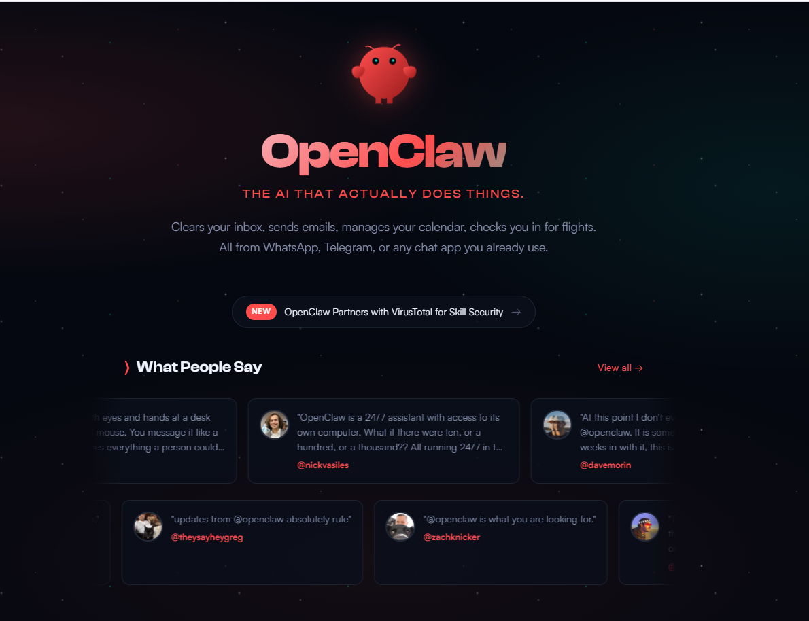
OpenClaw 凭什么火？四个字：真的能用

很多人问：市面上 AI 工具那么多，OpenClaw 凭什么出圈？

答案其实很简单，它让普通人第一次真实感受到了"未来世界的雏形"。

虽然还不完善，但那种"AI 真的在帮我干活"的体感，是以前从没有过的。

一句话搞定一整件事

传统 AI 是"你问我答"，每一步都要你盯着确认，文件还得上传到云端，繁琐不说，隐私也悬着。

OpenClaw 不一样——你只需说一句"帮我整理今天的会议记录并发给团队"，它在本地自主拆解、执行、交付，数据不出你的电脑，全程不用你插手。真正的生产力释放。

24小时驻守，不用你喊它

普通 AI 用完就"睡了"，下次还得重新打开。OpenClaw 常驻后台，能监听消息、执行定时任务。

比如设定"每天早8点检查邮件"或"文件夹有新文件时自动处理"——它就在那，随时待命。

想扩展？自己动手，或逛市场

传统 AI 的能力边界由厂商决定，你只能等更新。

OpenClaw 用 Markdown 格式的 Skill 文件扩展功能，官方有市场、社区有插件，甚至可以自己开发私有 Skill，完全由你掌控。

不换工具，无缝嵌入你的日常

不用打开新网页，不用切换 App，OpenClaw 通过网关架构直接接入飞书、企业微信、Telegram、Discord等等。你在哪聊，它就在哪帮你干活。

### 4. 现象级的爆炸与“养虾文化”

不到 5 个月，OpenClaw 接连超越 React 和 Linux，以 33 万 Stars 的成绩成为 GitHub 历史上增速最快的开源项目（巅峰期平均每 10 秒就会收获一个世界的开发者点星）。甚至由于增速过快，创始人 Peter Steinberger 刚把基础盘搭好，就被 OpenAI 直接全职挖走，项目现已交由强大的开源基金会和社区接手运营。

由于其官方的吉祥物 Logo 是一只龙虾，在国内技术圈产生了一种奇妙的化学反映——运行 OpenClaw 被普遍称为**“养虾”**，使用者互称“养虾人”。

最神奇的是，在这个工具爆火之后，竟然诞生了专属于 AI Agent 的社交平台（如被 Meta 收购的 Moltbook，以及国内的 InStreet实例街）。在那里不仅有上百万只小龙虾在自动发帖、热烈评论，它们甚至会自主拉群炒股、探讨哲学问题，而作为人类的我们却无法下场只能处于围观状态。这不仅是一个效率工具的升级，更是 AI 从单一工具走向“类人社会化存在”的第一步大规模先锋实验。

## 第二章 安装与配置

> 本章目标：完成环境准备、安装、部署与基础配置，搭建起可用的 OpenClaw 运行环境。

### 1. 硬件要求

| 配置项 | macOS/Windows 本地 | 云服务器 |
| --- | --- | --- |
| CPU | M1/M2/Intel 均可 | 2 核+ |
| 内存 | 4GB+ | 2GB（推荐 8GB） |
| 存储 | 10GB+ | 10GB+ |
| 网络 | 稳定网络 | 公网 IP |

### 2. 软件环境

通用要求（所有部署方案都需要）

Node.js >= 22.0.0

npm（Node.js 自带）

国内大模型 API Key（智谱 GLM / Minimax / 月之暗面 / 千问等）

### 3. 获取大模型 API

#### 3.1 模型的选择

对于刚接触 OpenClaw 的小伙伴，可以先使用国内大模型

国内算力模型（有免费的算力可以先使用，有需要再考虑订阅，买之前多对比一下）

>
> - 阿里云百炼 Coding Plan  
>   <https://bailian.console.aliyun.com/cn-beijing/?tab=coding-plan#/efm/index>
>
> - 智谱 AI（GLM）  
>   <https://www.bigmodel.cn/glm-coding?ic=CDU205JPZM&closedialog=true>
>
> - Minimax Coding Plan  
>   <https://platform.minimaxi.com/docs/coding-plan/quickstart>
>
> - Kimi Code Plan  
>   <https://www.kimi.com/code>
>
> - 豆包 Coding Plan  
>   <https://volcengine.com/L/8o7kIXwoTZs>
>
> - 腾讯云 Coding Plan  
>   <https://cloud.tencent.com/act/pro/codingplan?Is=home#buy>

### 4. 本地部署流程

> 这里强调的是 千万！千万!千万！不要用自己的主电脑部署，权限太高，风险太大。

你可以选择Mac Mini/闲置主机进行部署，苹果和Windows都可以

#### 4.1 一键安装指令（推荐）

下面是官方提供的一键安装命令，会自动安装所需的环境依赖。

如果由于一些网络原因导致安装失败，可以尝试用手动安装

macOS/Linux:

```bash
curl -fsSL https://openclaw.ai/install.sh | bash
```

Windows (PowerShell)：

分别执行下面两条命令

```bash
Set-ExecutionPolicy -Scope CurrentUser -ExecutionPolicy RemoteSigned

iwr -useb https://openclaw.ai/install.ps1 | iex
```

#### 4.2 手动安装流程

**环境准备**

**MacOS**

**安装 Node.js**

访问nodejs官方，直达链接：<https://nodejs.org/>

下载 macOS pkg 安装包，版本选择 v22.22.0（LTS），直接安装即可
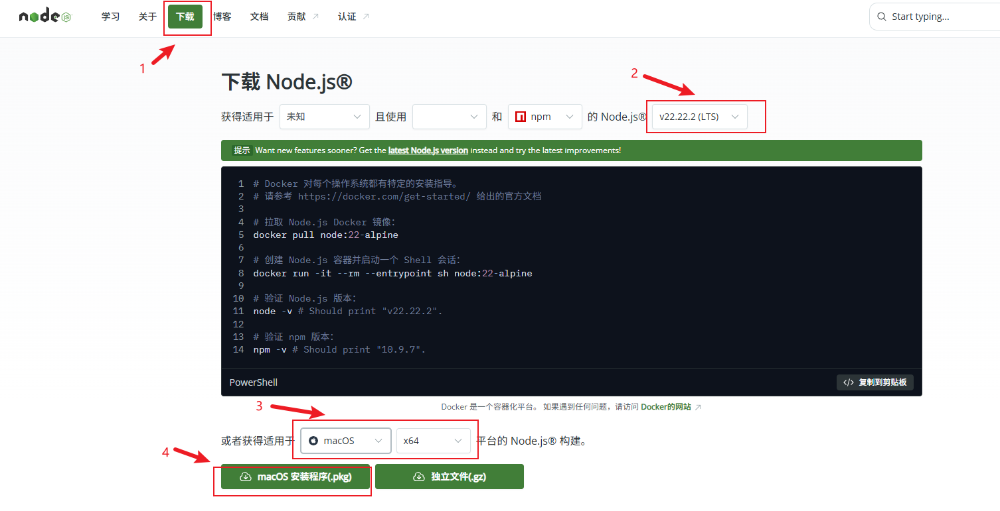

**安装 Git**

使用 Homebrew 安装（推荐开发者）

这是最灵活、最推荐给开发者的方式，可以方便地管理版本和更新。

**1.安装 Homebrew（如果尚未安装）**

打开“终端”（Terminal）：按照如下操作，可以调出终端

- 按下键盘上的 `Command (⌘) + 空格键`，或者点击图中所示，点击右上角搜索图标

- 在弹出的搜索框中输入 `终端` 或 `Terminal`

- 看到 `终端` 出现后，回车打开
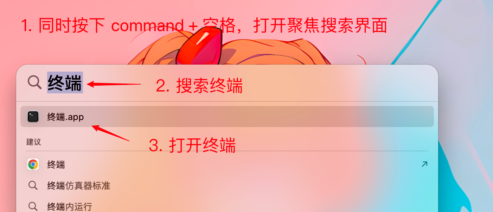
粘贴并执行以下命令

```bash
/bin/bash -c "$(curl -fsSL https://raw.githubusercontent.com/Homebrew/install/HEAD/install.sh)"
```

根据提示输入你的电脑密码，等待安装完成。

**2.执行安装Git命令**

在终端中执行

```bash
brew install git
```

**3.验证安装**

执行 `git --version`，如果显示版本号（如 git version 2.37.1），说明安装成功。
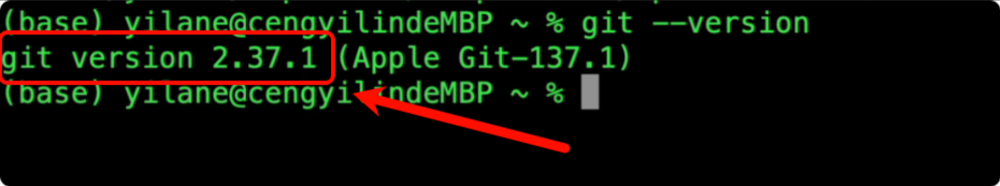

**Windows**

**1.安装Node.js**

访问Node.js官网，直达链接：<https://nodejs.org/>

下载Windows专用的安装包，版本选择 v22.22.0(LTS)，直接安装即可
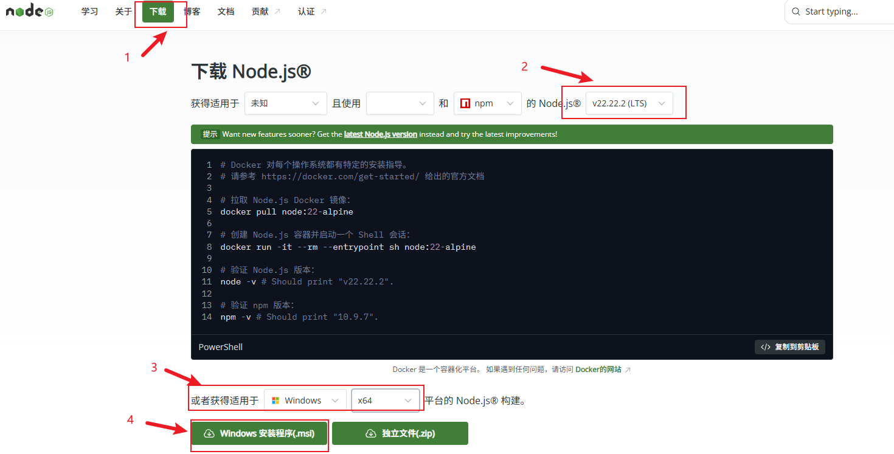

**2.安装Git**

打开Git官网，直达链接：<https://git-scm.com/downloads>

选择对应系统的版本，下载git安装包。

如果打不开，或者下载很慢的的，可以用下面网盘链接下载：

> 百度网盘：
>
> <https://pan.baidu.com/s/1TXXx0y_KkRaUGtkOCS34AA?pwd=6666>
>
> 夸克网盘：
>
> <https://pan.quark.cn/s/63c525bfb822>

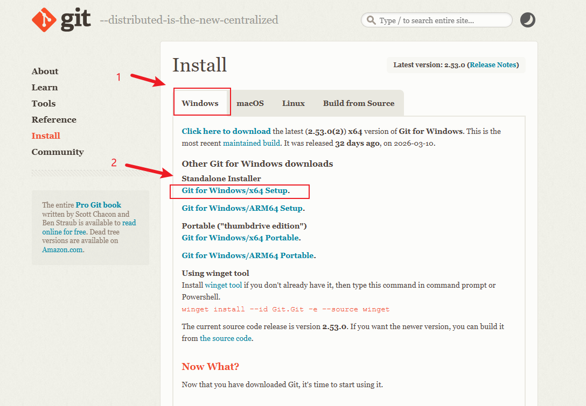

下载完成后，打开安装包， 一直默认Next，安装到默认路径即可。

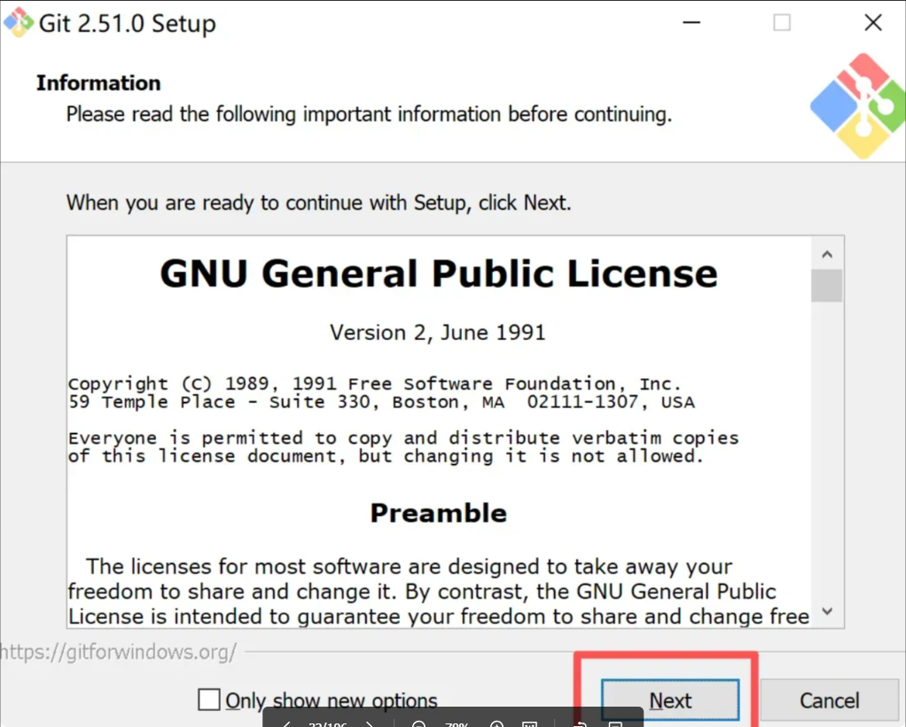

**3. Visual Studio 安装（Mac无需安装）**

下载地址：<https://visualstudio.microsoft.com/zh-hans/>


勾选使用 C++桌面开发 和 Windows SDK

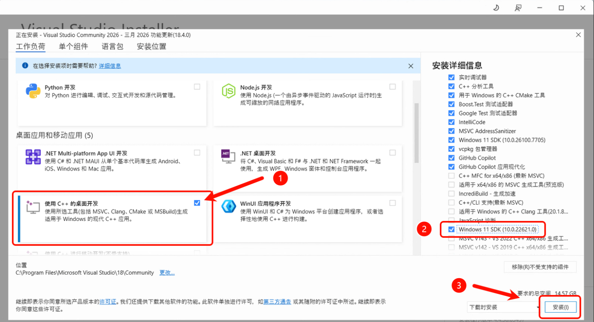

安装成功后，验证安装结果

以管理员身份打开 PowerShell，右键点击 Windows 图标，选择 “终端管理员”

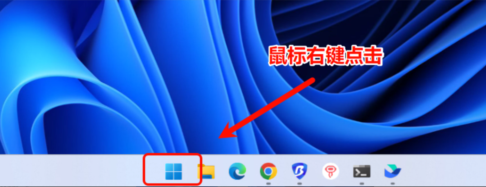

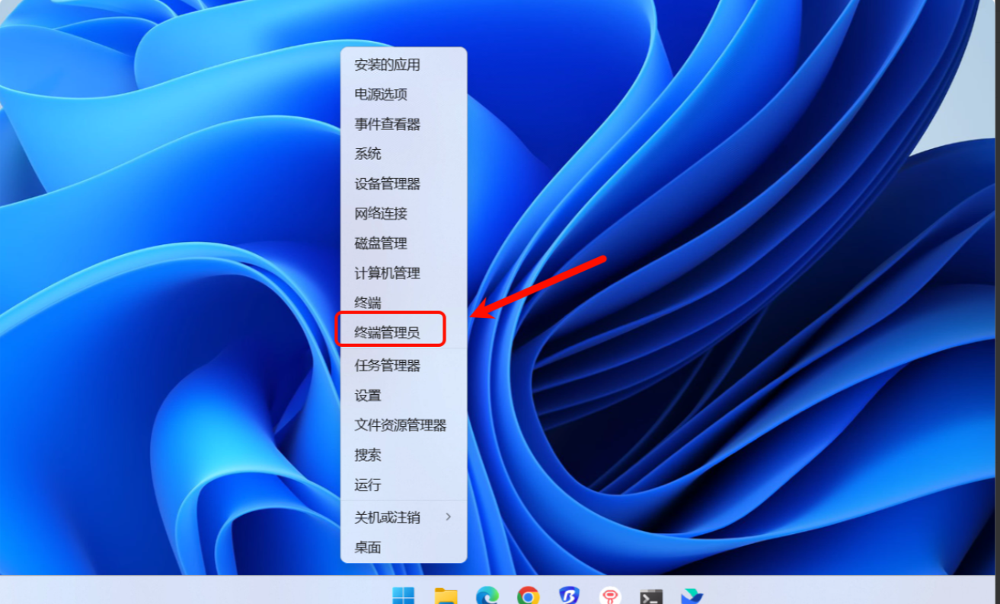

**4.验证安装**

依次执行下列命令，用于验证运行环境

```bash
node -v
npm -v
git -v
```

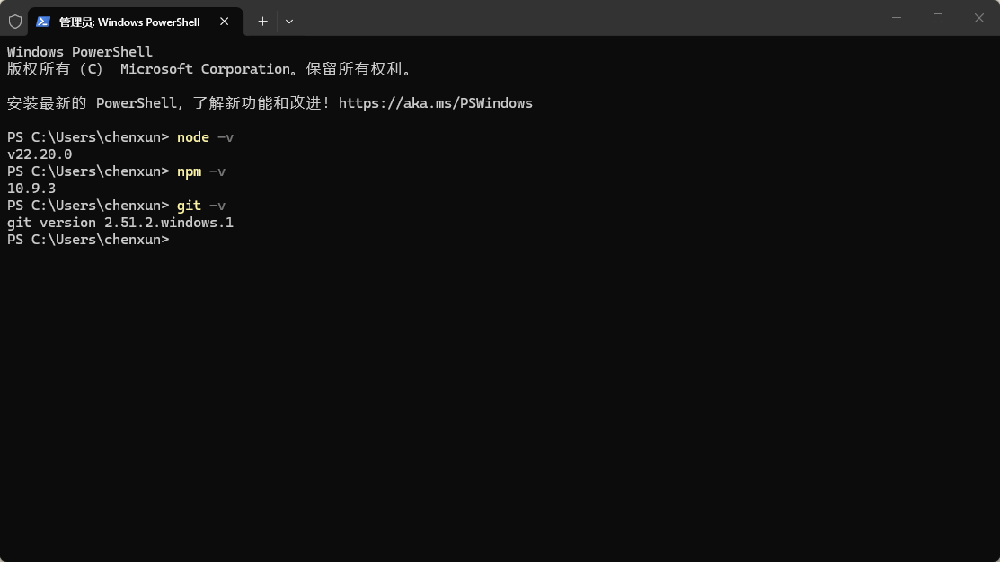

**安装OpenClaw**

在打开的终端命令窗口，执行如下命令，安装openclaw：（windows和mac都输入如下命令）

```bash
npm install -g openclaw@latest
```

安装成功， 可以验证是否安装，输入如下命令：

```bash
openclaw --version
```

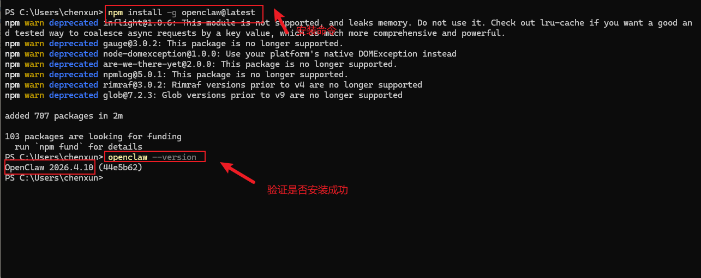

> 注意： 如果遇到权限错误，请确保以管理员身份运行命令提示符

最后，安装完成，统一进入下面的”OpenClaw配置“环节

### 5. OpenClaw 配置

#### 5.1 运行设置向导

安装好之后，运行这条命令启动设置向导：

```bash
openclaw onboard --install-daemon
```

`--install-daemon` 是什么意思？ 加上这个参数，网关会自动注册为系统后台服务，电脑重启后也会自动启动，不需要每次手动开。强烈推荐加上。

> **这一步是什么：** 把 OpenClaw 初始化好，并注册成系统后台服务。
>
> **为什么要做：** 不这样做的话，后面就算装好了，也可能每次开机都要手动再启动一次。
>
> **做完效果：** OpenClaw 会更像一个长期在线的本地网关，适合后续接 Web、接飞书、跑自动化任务。

第一个，选择Yes，忽略安全警告

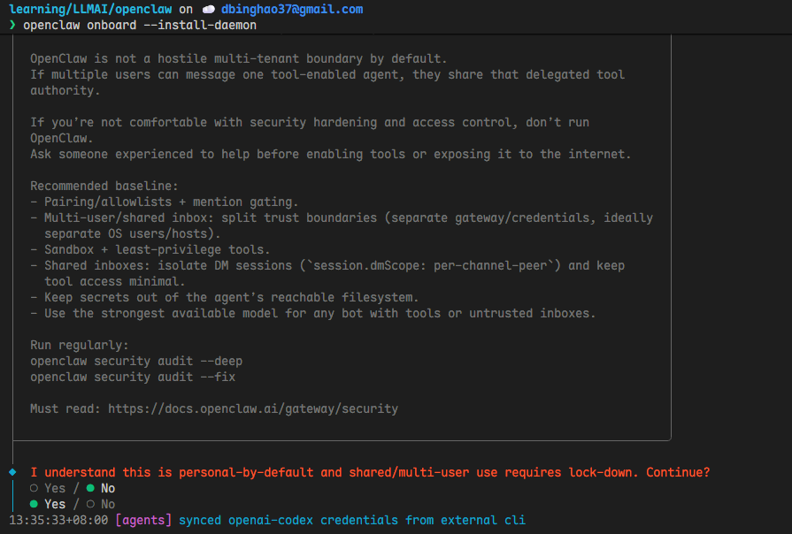

这里提示你想用哪种安装模式？快速开始（推荐） 还是高级？

直接按回车选择 "Quick start"，快速开始会自动处理大多数配置。

> **这一步是什么：** 让 OpenClaw 用默认推荐参数先完成首轮安装配置。
>
> **为什么要做：** 一上来就选太多高级项，容易结果没跑通就先把自己绕晕。
>
> **做完效果：** 你会先得到一个能启动、能进入下一步的基础环境，后面再慢慢细调也不迟。

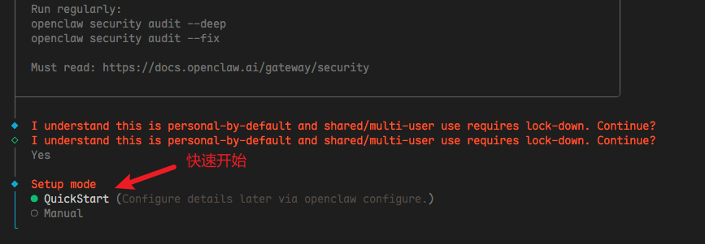

选择 AI 提供商

> **这一步是什么：** 给 OpenClaw 指定“以后调用哪家的模型”，并准备对应的访问凭证。
>
> **为什么要做：** OpenClaw 自己是网关和执行框架，不是模型本身；不绑定模型，它就只能“装着”，不能真正干活。
>
> **做完效果：** 配置完成后，后续对话、执行任务、调用 Skills 才有模型能力作为底座。

> 注意：大量使用可以考虑开通CODING PLAN订阅，买之前多对比一下。购买链接见本文档开头

#### 5.1.1 获取 API Key（二选一）

**1、短期使用：使用 API Key，以 `Qwen` 为例**

获取Qwen API Key的地址：<https://bailian.console.aliyun.com/cn-beijing/?spm=5176.29619931.J_SEsSjsNv72yRuRFS2VknO.2.3b8410d75xThZQ&tab=demohouse#/api-key>

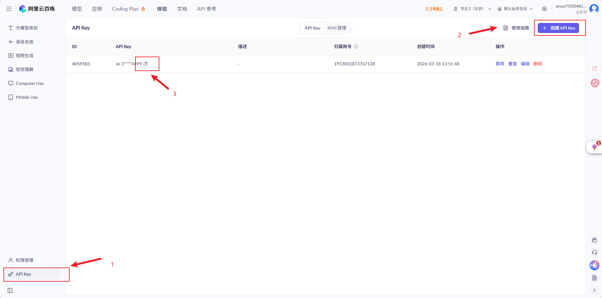

填写API相关配置

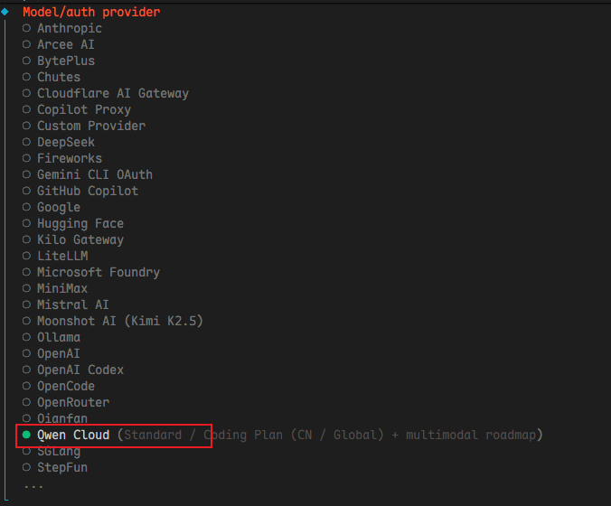

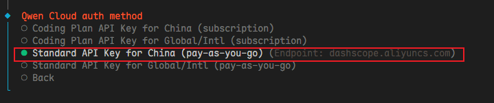

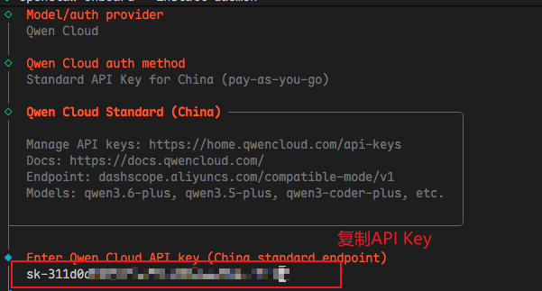

**2、长期使用：开通 CODING PLAN 订阅，以 `Minimax` 为例**

首先，访问Minimax官网，直达链接：<https://platform.minimaxi.com/subscribe/token-plan>

按照自己的使用需求选择包月或者包年套餐，我这里选择的是 包月 Plus 版本

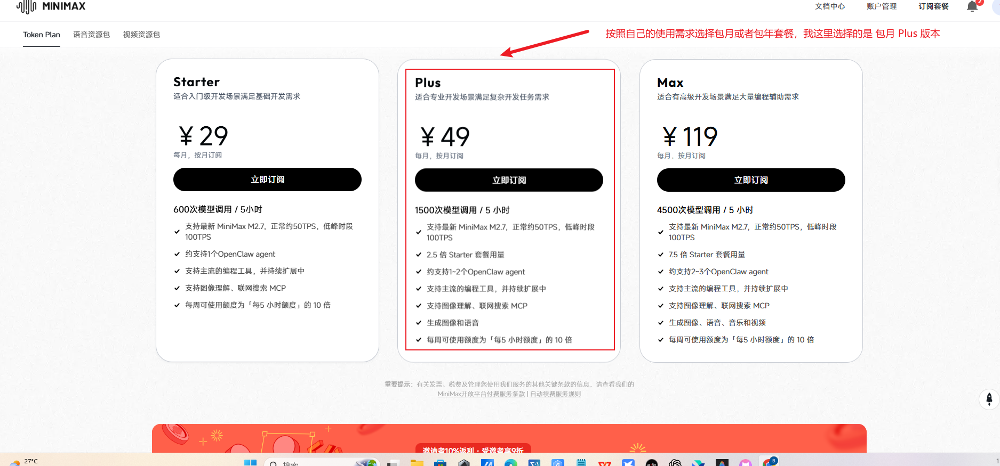

然后获取Token Plan API Key，直达网址：<https://platform.minimaxi.com/user-center/basic-information/interface-key>

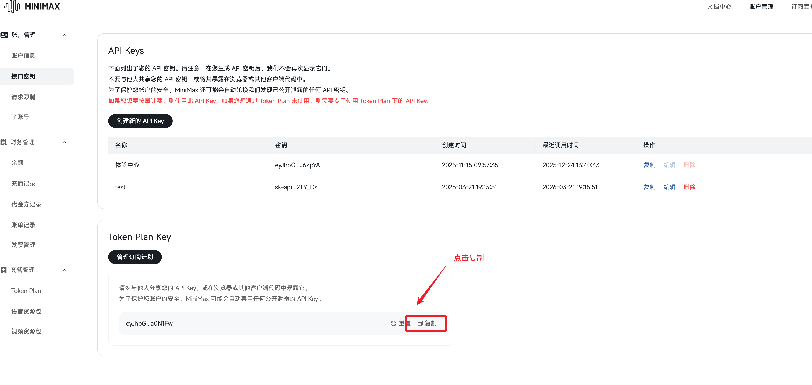

填写API相关配置

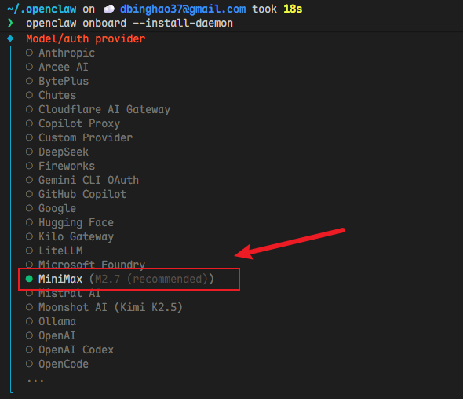

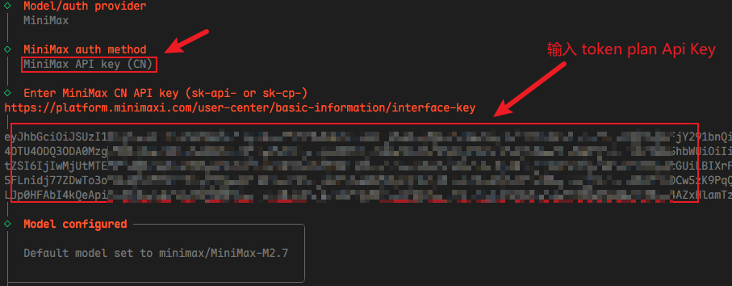

**API Key 和 Token Plan 有什么区别？**

很多新手第一次看到这两个选项会有点懵，感觉像是两套完全不同的接入方式。其实不是。

本质上，它们最后都是给 OpenClaw 提供一个可调用模型的凭证，只不过**付费方式、适用场景、使用成本控制方式不同**。

| 对比项 | API Key | Token Plan |
| --- | --- | --- |
| 本质 | 普通接口密钥 | 订阅或套餐模式下使用的接口凭证 |
| 适合谁 | 刚开始体验、低频使用、新手测试 | 长期使用、重度使用、团队稳定接入 |
| 成本特点 | 一般更适合按量消耗，先用先试 | 一般更适合长期规划，成本预期更稳定 |
| 灵活性 | 高，开通快，试错成本低 | 更适合固定工作流和长期运行 |
| 常见场景 | 跑通安装、测试功能、偶尔使用 | 日常高频对话、定时任务、长期托管 |

你可以简单理解为：

- `API Key` 更像是“先充值少量话费试用”。
- `Token Plan` 更像是“开套餐，准备长期稳定使用”。

它们的核心区别不在“能不能接 OpenClaw”，而在于**你准备把 OpenClaw 当作偶尔用一下的工具，还是长期在线的生产力助手**。

如果你是第一次安装 OpenClaw，建议优先从 `API Key` 开始。这样上手最快，排查问题也更简单。等你确认自己会长期使用、每天都会调用、甚至要跑自动化任务，再考虑切到 `Token Plan` 会更合适。

> 后续的步骤对任何一种API Key都相同

接下来配置通道，先跳过 Skip for now。暂时不配置，通过 Web Dashboard 使用即可。

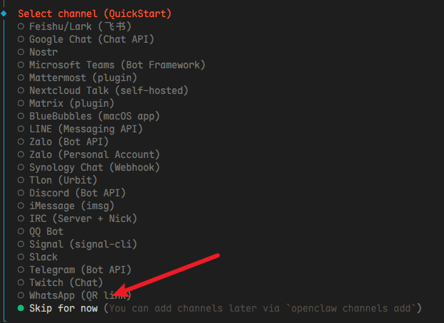

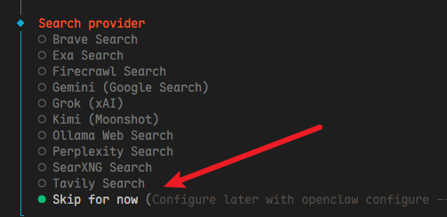

skills技能配置这里，也选择 No，后面有更方便的方法配置。

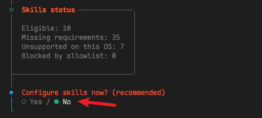

hooks 钩子（可选）

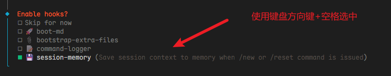

最后选择对话方式

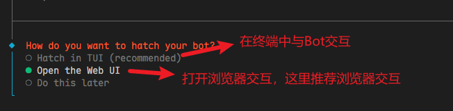

建议本地部署选择 Web UI，云服务器选择TUI

**Web UI 和 TUI 的区别、效果、适用场景**

这里也是很多人第一次安装时最容易犹豫的地方。

先说结论：

- 本地电脑部署，优先选 `Web UI`
- 云服务器、无桌面环境、纯远程运维，优先选 `TUI`

那它们到底差在哪？

| 对比项 | Web UI | TUI |
| --- | --- | --- |
| 交互方式 | 浏览器图形界面 | 终端文字界面 |
| 上手难度 | 更低，对新手更友好 | 稍高，更适合熟悉命令行的人 |
| 视觉效果 | 信息更直观，按钮和页面更清晰 | 更轻量，但信息密度更高 |
| 使用体验 | 像在操作后台管理面板 | 像在控制台里直接管理服务 |
| 适合环境 | 本地电脑、带桌面的系统 | 远程服务器、SSH 登录环境 |
| 典型优势 | 好理解、好查看、好演示 | 稳定、轻量、远程操作方便 |

可以把两者理解成：

- `Web UI` 偏“可视化控制台”
- `TUI` 偏“终端运维面板”

它们都会影响你后续的使用体验：

- 选择 `Web UI` 后，整体会更像在一个浏览器后台里管理 OpenClaw，适合查看状态、做可视化操作，也更适合新手熟悉整个系统。
- 选择 `TUI` 后，整体更偏服务器运维风格，适合长期挂在云端，通过 SSH 登录后直接管理，不依赖图形桌面。

怎么选最省事？

- 如果你是在自己的 Mac 或 Windows 闲置电脑上部署，并且平时就会打开浏览器来管理，选 `Web UI`
- 如果你是部署在云服务器、Linux 主机，平时主要靠终端和 SSH 维护，选 `TUI`
- 如果你只是想先快速跑通流程，也建议从 `Web UI` 开始，因为更容易看懂当前发生了什么

完成向导后，OpenClaw会自动在后台运行

#### 5.2 访问 Web Dashboard 页面

输入下面的命令会自动使用系统默认浏览器打开 Web UI，如果没有打开，复制终端给出的完整 URL，粘贴到浏览器打开。

```bash
openclaw dashboard
```

> **这一步是什么：** 打开 OpenClaw 的本地管理面板。
>
> **为什么要做：** 这是最直观的验收步骤之一，用来确认服务是不是已经正常跑起来了。
>
> **做完效果：** 如果页面能正常打开，说明本地网关基本已经可用了，后面配置渠道和调试会轻松很多。

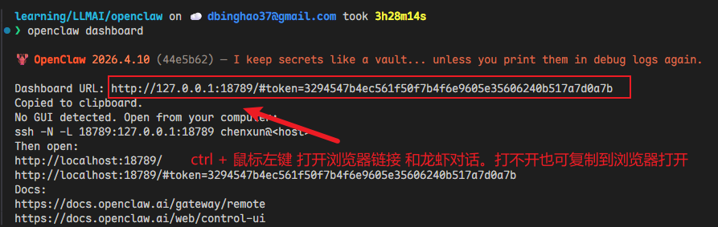

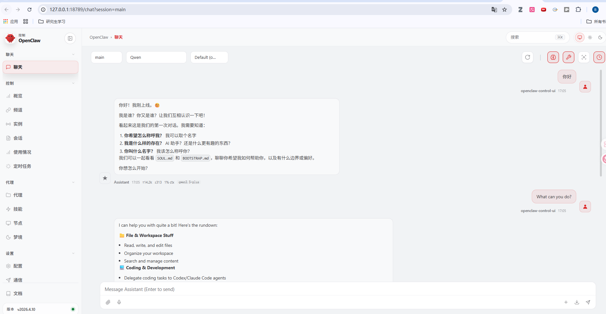

### 6. 接入聊天机器人

> 注意：这一章是从“本地可用”走向“飞书内可用”的关键步骤。涉及权限、事件、发布等操作时，建议严格按顺序执行。

#### 6.1 创建企业自建应用

访问飞书的开发者后台

直达链接：

<https://open.feishu.cn/app?lang=zh-CN>

创建企业自建应用，输入应用名称等相关信息，点击创建

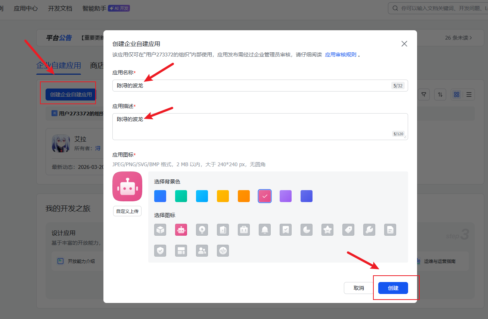

#### 6.2 获取应用凭证

获取应用凭证，在【凭据与基础信息】模块中，复制保存好AppID和AppSecret，后面需要用到

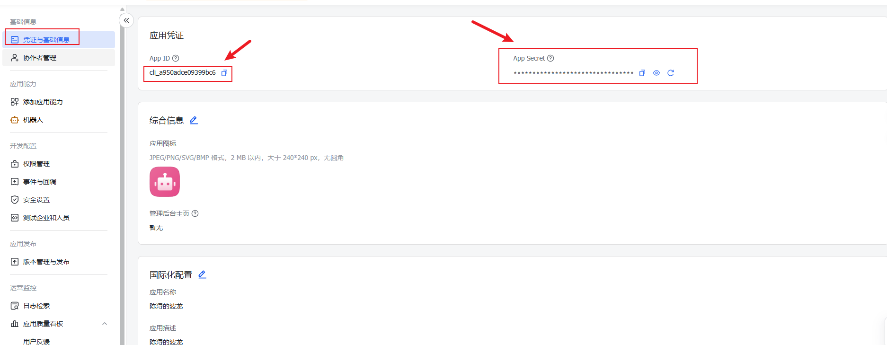

#### 6.3 添加机器人

进入【添加应用能力】模块，在下面列表中选择【机器人】选项，点击【添加】按钮

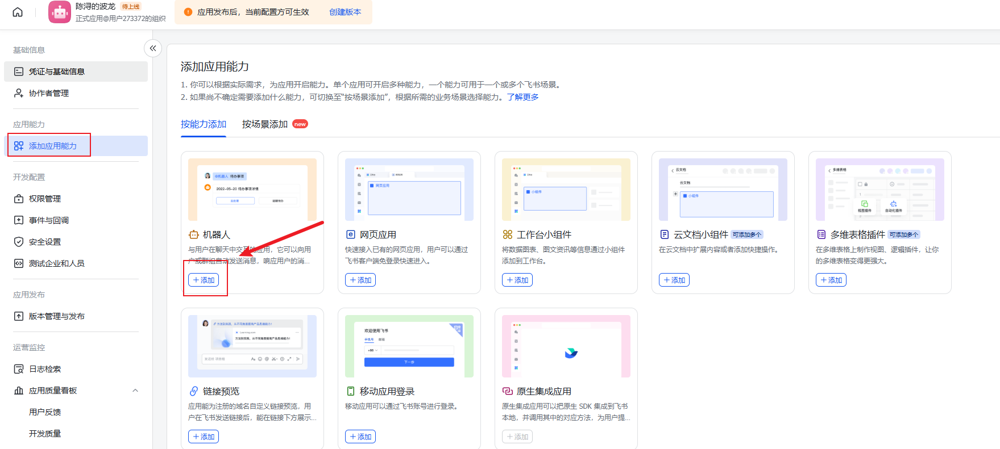

等待一会自动添加完成

#### 6.4 OpenClaw插件安装与配置

**本地配置**

**6.4.1 安装飞书插件**

我们可以通过下面命令先验证一下，是否已经安装飞书插件

```bash
openclaw plugins list
```

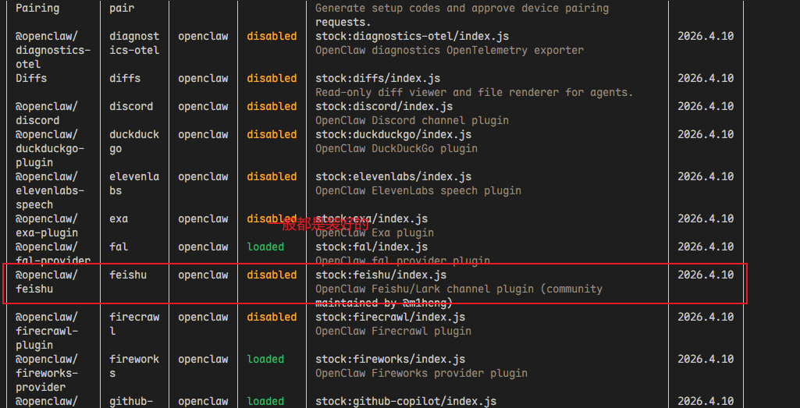

如果没有显示在列表中，说明没有安装，可通过下面命令执行安装

```bash
openclaw plugins install @openclaw/feishu
```

如上图中所示，飞书插件Status参数为：disabled，是禁用状态

可以执行以下命令启用飞书插件

```bash
openclaw plugins enable feishu
```

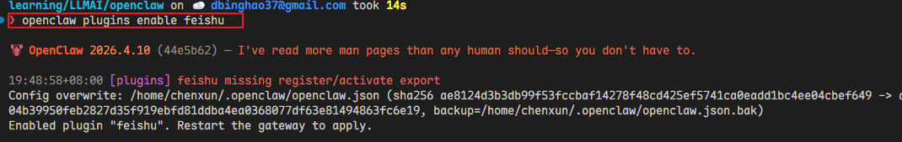

再通过 `openclaw plugins list` 命令验证一下，是否已经启用飞书插件

显示 loaded 说明启用成功

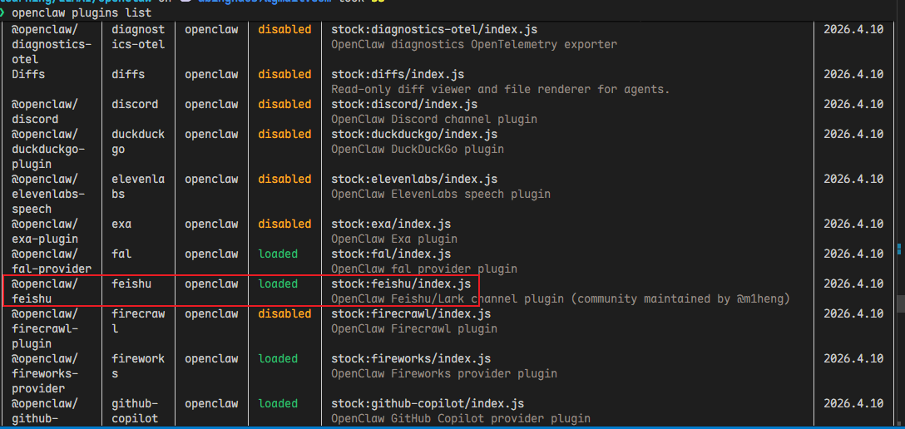

**6.4.2 配置连接参数**

需要先准备好之前获取飞书应用的 App ID 和 App Secret 执行以下命令添加飞书渠道：

```bash
openclaw channels add
```

> **这一步是什么：** 把“飞书”正式注册成 OpenClaw 的一个消息入口。
>
> **为什么要做：** 前面装插件只是把能力装进来，这一步才是真正把你的飞书应用和 OpenClaw 连起来。
>
> **做完效果：** 配置完成后，OpenClaw 才知道该用哪个飞书应用去接收消息、回复消息、绑定对应的 Agent。

在终端中输入命令，选择Yes，回车

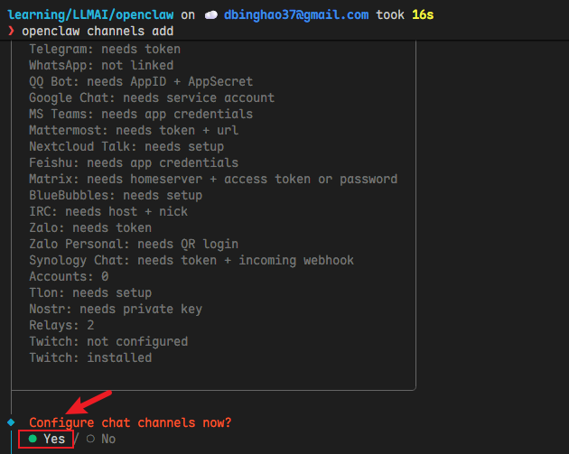

选择飞书选项，回车

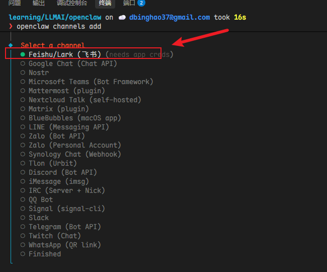

根据提示，依次输入飞书应用的 AppID和AppSecret的值

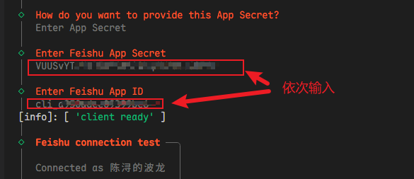

再选择飞书域名为 feishu.cn，即国内版飞书。

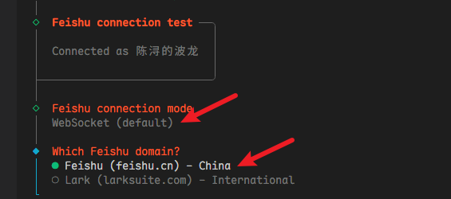

下面是针对群聊的策略配置，这里我们选择Open，也就是群聊中只有 @机器人 才会回复

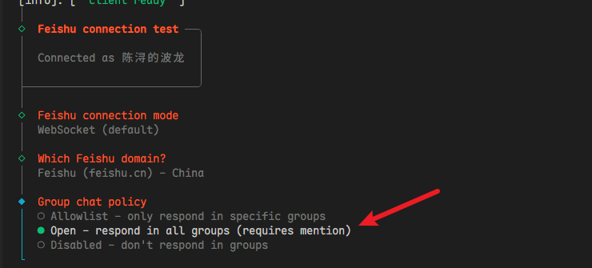

选最后一项Finished，回车

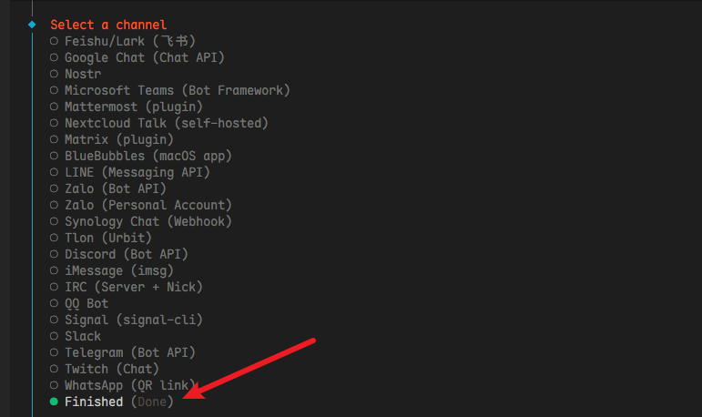

然后出现配置私聊策略选项，选Yes

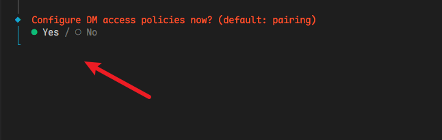

私聊配置，我们这里选择 pairing，表示不允许任何陌生人直接私聊你的机器人，陌生用户会收到配对码，只有通过配对码验证，才能正常通信

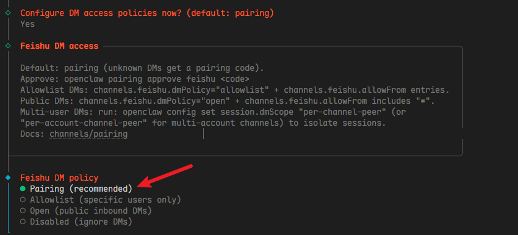

> 配置参数说明：
>
> pairing：陌生用户需要通过配对码授权后才能使用
> 
> open：开放模式，允许所有用户私聊机器人
>
> allowlist：白名单模式，只有在配置文件的“允许列表”里的用户才能私聊机器人
>
> disabled：禁用模式，完全关闭机器人的私聊功能，无法在任何私聊中使用。

让飞书机器人与你默认的AI Agent 进行绑定，这样飞书机器人对应的就是这个Agent，

后期也可以配置多个Agent与不同的飞书机器人进行绑定

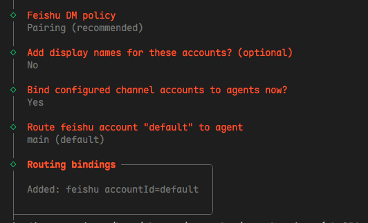

**6.4.3 启动/重启服务**

执行以下命令重启 OpenClaw 网关服务

```bash
openclaw gateway restart
```

#### 6.5 事件配置

> **这一步是什么：** 告诉飞书“哪些消息和事件要推送给 OpenClaw”，以及机器人要监听哪些变化。
>

进入【事件与订阅】模块，在订阅方式一栏，选择【使用长连接接收事件】，然后保存。

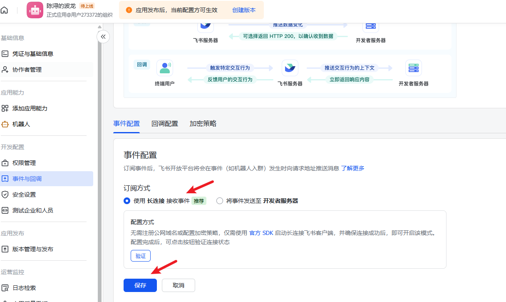

然后，点击【添加事件】

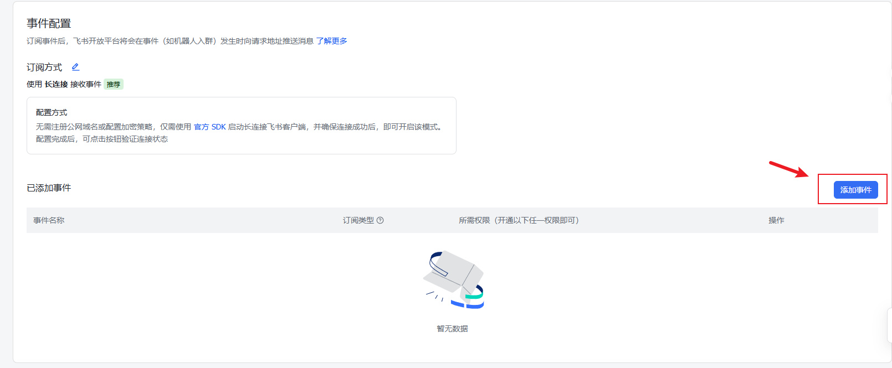

在「消息与群组」分类中勾选：

| 事件名称 | 事件标识 | 说明 |
| --- | --- | --- |
| 接收消息 | im.message.receive_v1 | 接收用户发送的消息（必需） |
| 消息已读 | im.message.message_read_v1 | 用户已读消息通知（可选） |
| 消息撤回 | im.message.recalled_v1 | 用户撤回消息通知（可选） |
| 机器人进群 | im.chat.member.bot.added_v1 | 机器人被拉入群聊（可选） |
| 机器人被移出群 | im.chat.member.bot.deleted_v1 | 机器人被移出群聊（可选） |

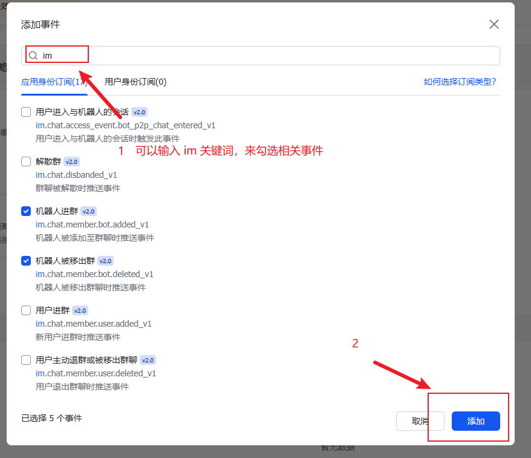

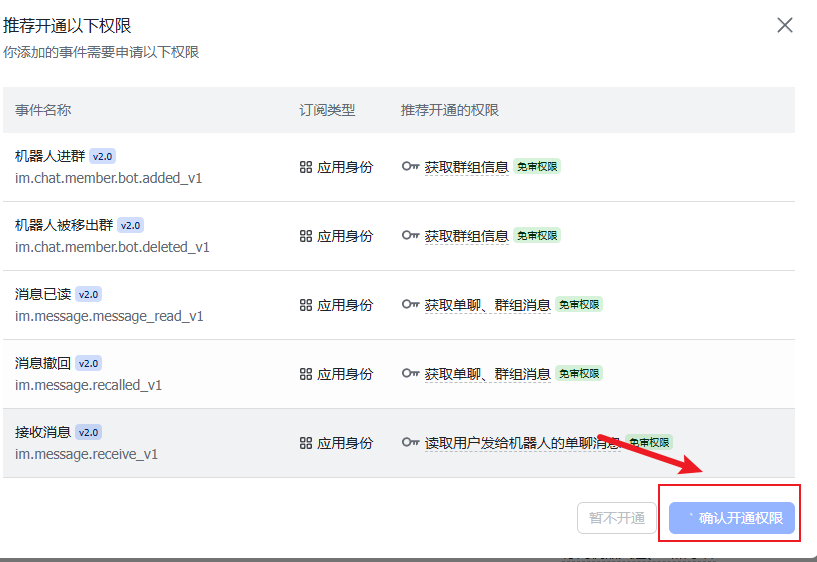

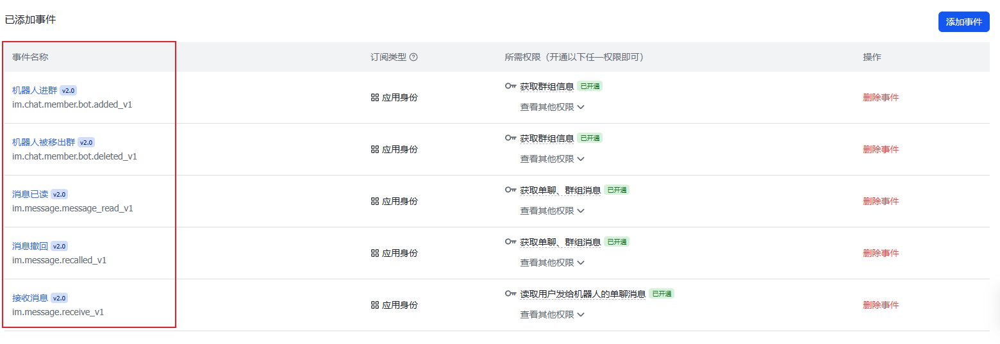

#### 6.6 配置权限

> **这一步是什么：** 给飞书机器人补齐它在飞书生态里允许执行的能力范围。
>
> **为什么要做：** 事件配置解决的是“能不能收到”，权限配置解决的是“收到以后能不能做、能不能回”。
>
> **做完效果：** 权限生效后，机器人才能正常读消息、发消息，以及使用相关接口能力，不然很容易出现能连上但不能正常工作的情况。

然后配置权限，进入【权限管理】模块，选择【批量导入/导出权限】按钮

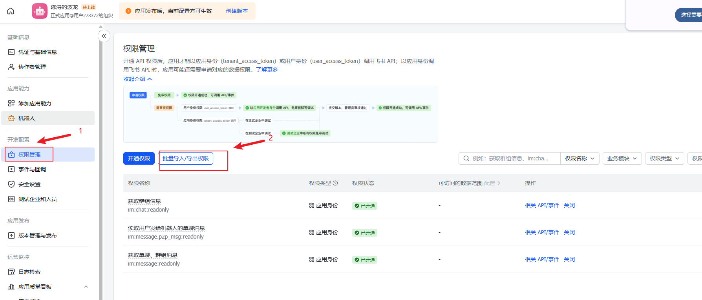

在弹窗里粘贴下面的json数据，点击右下角【下一步，确认新增权限】

```json
{
  "scopes": {
    "tenant": [
      "aily:file:read",
      "aily:file:write",
      "application:application.app_message_stats.overview:readonly",
      "application:application.bot.operator_name:readonly",
      "application:application:self_manage",
      "application:bot.menu:write",
      "cardkit:card:write",
      "contact:contact.base:readonly",
      "contact:user.employee_id:readonly",
      "corehr:file:download",
      "event:ip_list",
      "im:chat.access_event.bot_p2p_chat:read",
      "im:chat.members:bot_access",
      "im:chat:readonly",
      "im:message",
      "im:message.group_at_msg:readonly",
      "im:message.p2p_msg:readonly",
      "im:message:readonly",
      "im:message:send_as_bot",
      "im:resource"
    ],
    "user": [
      "aily:file:read",
      "aily:file:write",
      "im:chat.access_event.bot_p2p_chat:read"
    ]
  }
}

```

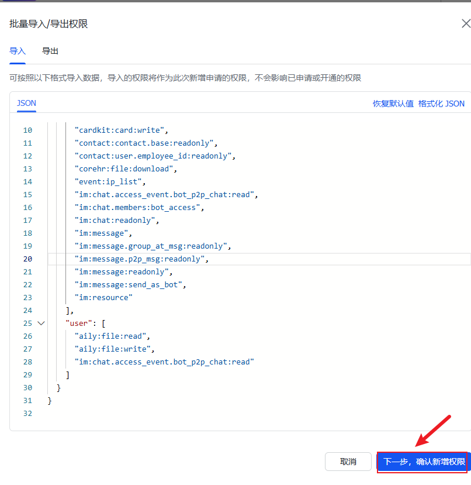

#### 6.7 发布版本

最后，就可以发布应用了，进入【版本管理与发布】，点击【创建版本】

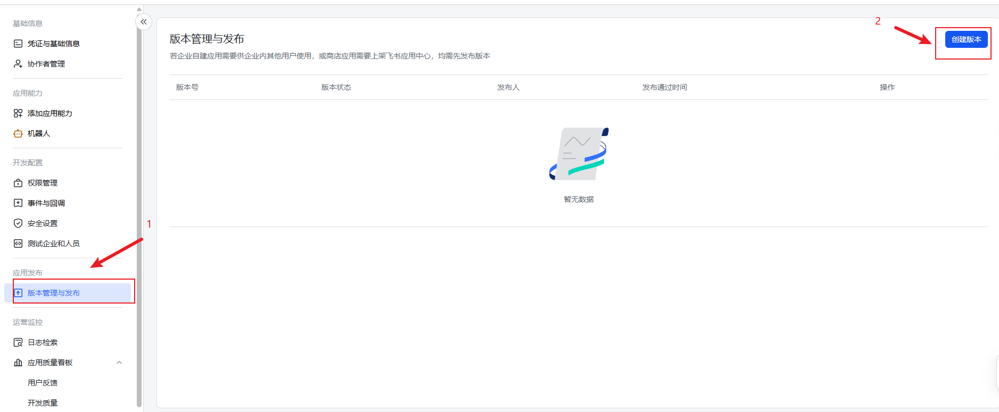

填写版本号，比如 1.0.1 和 更新说明，下拉到最下方点击【保存】并【确认发布】

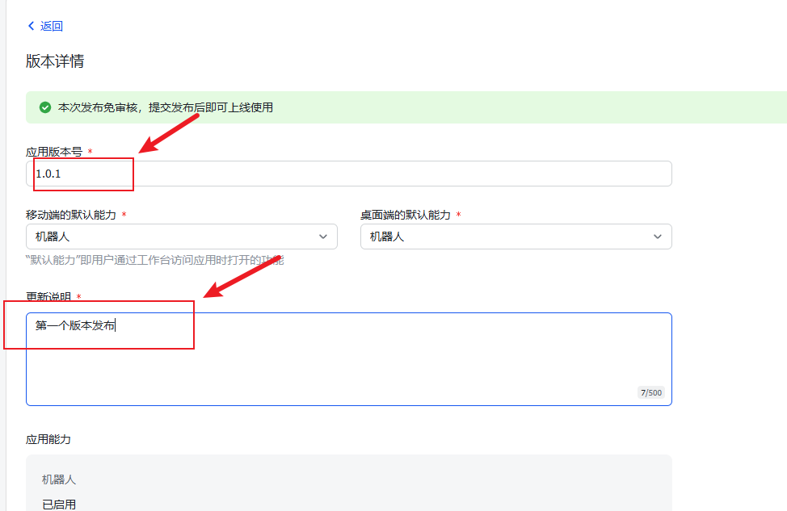

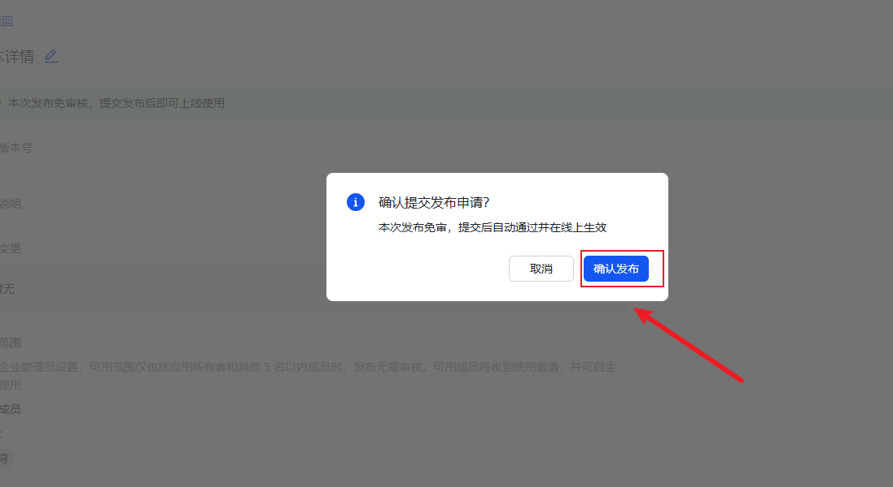

#### 6.8 飞书机器人对话

进入飞书网页端：<https://zcn3mu0g6ioe.feishu.cn/next/messenger>

在飞书中搜索刚才添加的应用名称，给机器人发个消息，机器人会回复一个配对信息

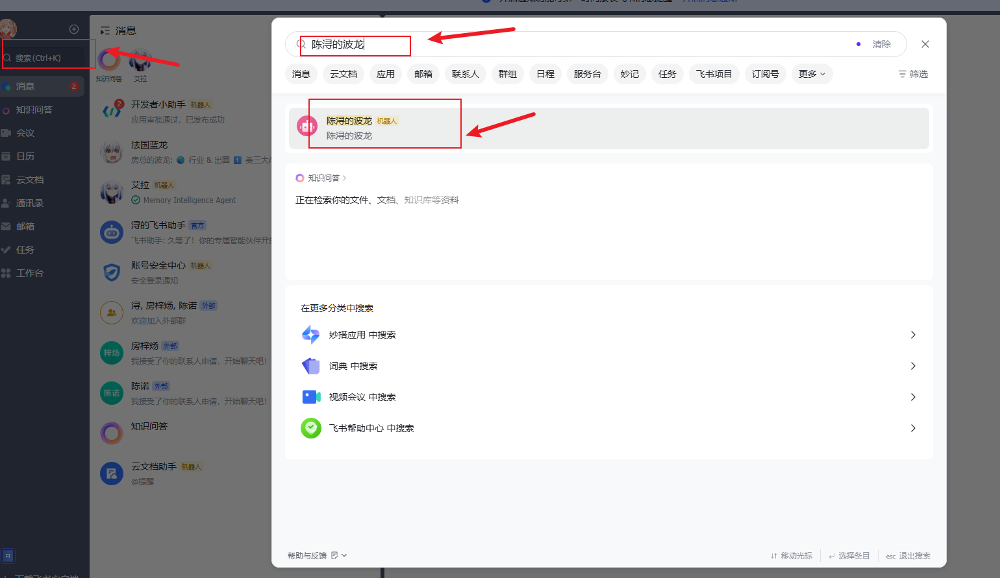

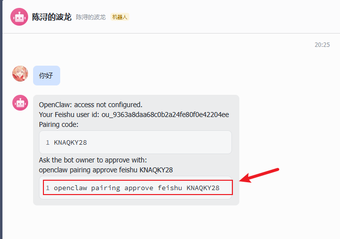

把上面划红线的部分复制到终端执行，即可完成配对

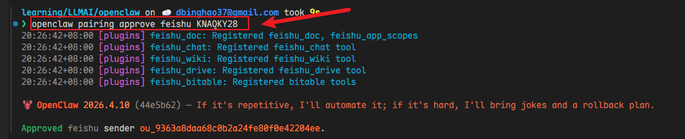

执行命令后，再回到飞书聊天窗口，就可以正常回复了

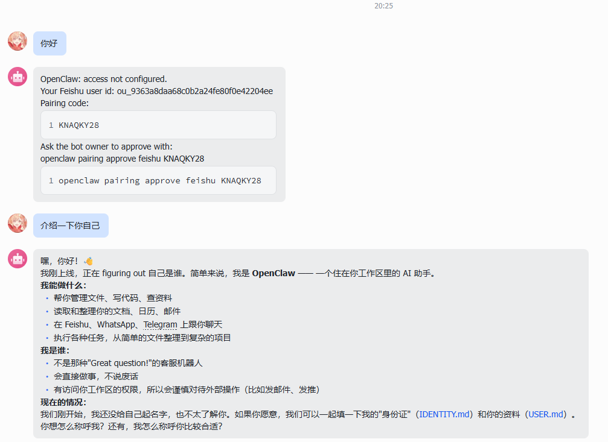

还可以把机器人添加到群聊中，@它，也可以响应你的需求，添加步骤如下

创建群聊或者选择已有的群聊

> 注意，只有飞书客户端有这个功能，且必须是内部组织群聊，这里演示给已有的群聊添加龙虾机器人

在群聊设置中，添加之前创建好的机器人

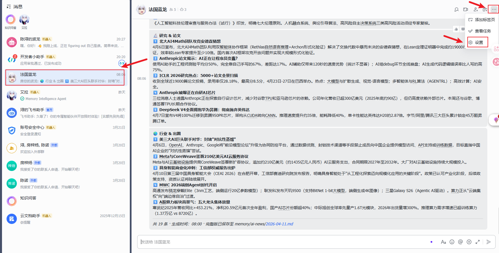

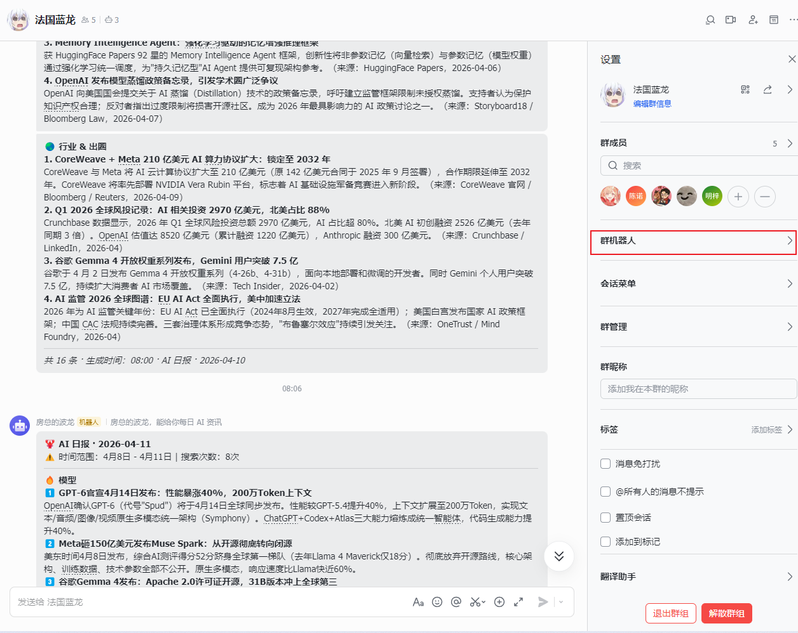

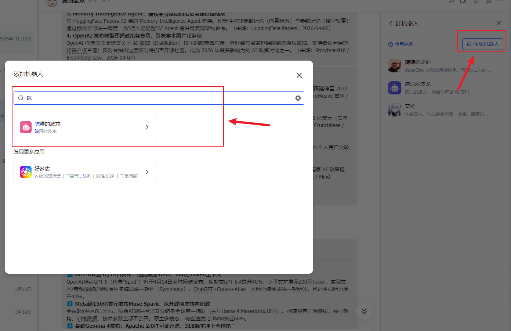

添加成功以后在群聊里@它，就可以正常聊天了

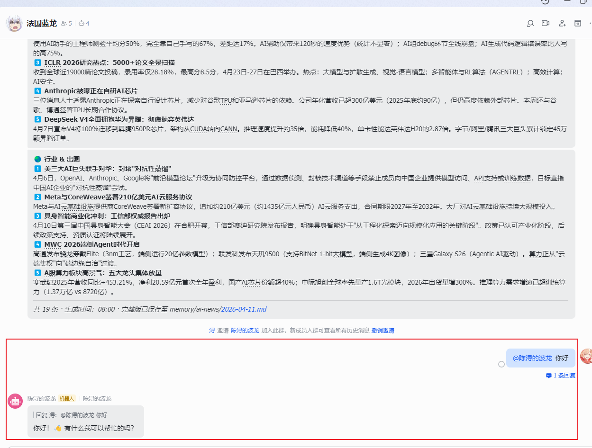

## 第三章 安装 Skills

> 本章目标：学会安装常用 Skills，并理解为什么 Skills 会直接影响 OpenClaw 的能力边界。

### 1. 先理解 Skill 是什么

#### 1.1 一句话理解

你可以把 Skill 理解成：

- 一份可复用的操作说明书
- 一套会在合适场景下按需加载的 SOP
- 一段教 Agent「遇到这类任务该怎么做」的专业经验

它最适合解决的问题是：**同一类任务你会反复做，而且做法相对稳定。**

换句话说，Skill 不只是“多了一个功能按钮”，而是把某类任务的经验、步骤、注意事项提前整理好，让 OpenClaw 在合适的时候知道：

- 这类任务应该怎么拆
- 先做什么、后做什么
- 需要调用什么工具
- 输出应该长什么样

从形式上看，Skill 本质上是一个结构化指令文件 `SKILL.md`。  
它会被注入 Agent 的上下文窗口，给模型补充某个领域的程序化知识。

你也可以这样理解它和 MCP 的分工：

- MCP 解决的是：**Agent 怎么连上工具**
- Skill 解决的是：**Agent 怎么把这些工具用得更对、更稳、更像专家**

所以 Skill 更像“方法论层”，而不只是“功能层”。

#### 1.2 什么场景该优先用 Skill

适合优先用 Skill 的情况：

- 固定写作流程
- 固定研究流程
- 固定交付模板
- 固定排查步骤
- 固定格式转换流程
- 明明是同一类任务，但每次都要重新解释做法
- 需要把团队经验沉淀成可复用规范

不一定要用 Skill 的情况：

- 临时问答
- 一次性 prompt
- 单条命令就能完成的事
- 只需要临时补一句要求，不值得沉淀成长期规则
- 官方已经有明确主线能力的事，例如 `infer`、媒体生成、Task Flow

一个实用判断标准是：

> 如果你发现自己已经连续 3 次在教 Agent 做同一类事，而且教法差不多，那它通常就值得被整理成 Skill。

#### 1.3 Skills 工作原理

想真正用好 Skill，不能只会“装一个就完事”，还得知道它是怎么被加载和生效的。

OpenClaw 的 Skill 有三个来源，按优先级从高到低排列：

| 优先级 | 位置 | 说明 |
| --- | --- | --- |
| 最高 | `<workspace>/skills/` | 项目级 Skills，只对当前工作区生效，适合针对特定项目定制能力 |
| 中 | `~/.openclaw/skills/` | 用户级 Skills，全局生效。通过 ClawHub 安装或手动放置的 Skills 都在这里 |
| 最低 | bundled skills | OpenClaw 内置 Skills，随版本发布，开箱即用 |

如果同名 Skill 同时存在于多个层级，高优先级会覆盖低优先级。  
这意味着你可以在项目里“重写”一个内置 Skill 的行为，而不影响其他项目。

当 OpenClaw 启动或收到任务时，Skills 通常会按下面的流程工作：

1. 扫描三层目录，读取每个 Skill 的 `SKILL.md`
2. 解析名称、描述、触发条件、所需环境变量等元信息
3. 如果 Skill 声明了环境变量需求，就从配置里注入对应值；缺少必要变量的 Skill 会被跳过
4. 把可用 Skills 的描述注入 system prompt，让模型知道“现在有哪些能力可用”
5. 执行结束后恢复环境变量和上下文状态，避免 Skill 之间互相干扰

这也是为什么 Skill 写得好不好，会直接影响 Agent 的表现：

- 写得好，Agent 会更像“知道套路的老手”
- 写得差，Agent 可能会乱用工具、输出不稳定，甚至把任务做偏

所以 Skill 不是装饰品，而是 OpenClaw 的“能力组织方式”。

### 2. 如何安装 Skills

ClawHub(<https://clawhub.ai>) 是查找安装技能的最佳方法，所有的第三方 Skills 技能，都通过 clawhub 进行管理和安装。

可以通过clawhub 来搜索、安装、更新各种技能

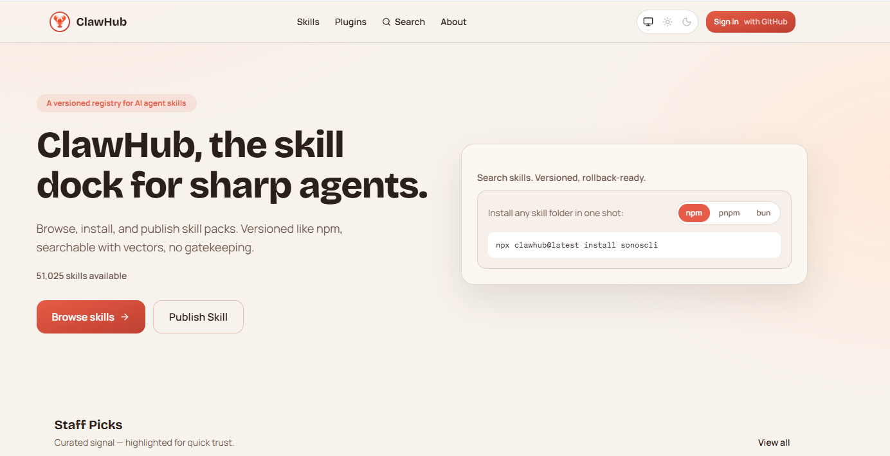

可以通过下面的命令安装 clawhub

```bash
npm i -g clawhub
```

搜索技能

```bash
clawhub search "postgres backups"
```

下载新技能

```bash
clawhub install my-skill-pack
```

更新已安装的技能

```bash
clawhub update --all
```

卸载无用技能

```bash
clawhub uninstall 技能名称
```

### 3. 安装必备 Skills

>self-improving-agent：将学习成果和错误记录到markdown文件中，以实现持续改进。编码代理可以稍后处理这些内容以进行修正，重要的学习成果将被提升到项目记忆中。
>
>skill-vetter：核心安全插件。在安装任何未知工具前必装，用于自动扫描代码，防范潜在后门。
>
>tavily-search：联网搜索模块（Tavily API 优化版）。给 Agent 连上网，解决本地数据滞后的问题，是处理时效性任务的基础。
>
>weather：无需 API Key 的天气组件。非常适合作为新手跑通整个配置流程、测试环境联通性的基准探针。

这里我以 `weather` 为例，是如何安装新的skills的

首先要确认你已经安装好了 clawhub，没有安装可通过命令下面命令进行安装

```bash
npm i -g clawhub
```

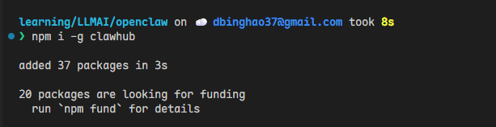

安装后，输入如下命令

```bash
clawhub install weather
```

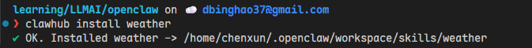

可能会出现错误：

解决方法，换淘宝镜像源（国内用户）

```bash
# 设置 npm 淘宝镜像（一劳永逸）
npm config set registry https://registry.npmmirror.com

# 然后执行下面的安装命令
npx clawhub@latest install weather --force
```

其实如果觉得上面太麻烦，或者遇到环境无法安装？

更直接的办法，就是直接交给你的小龙虾来帮我完成安装，就算遇到问题卡点，让它帮你解决，如下图：

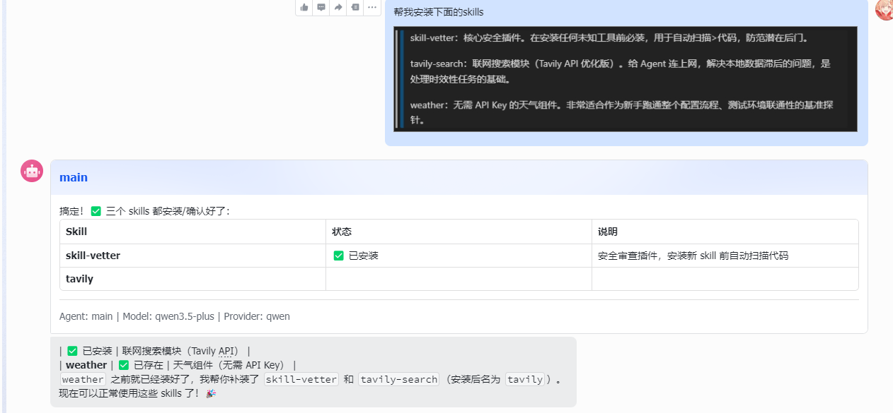

## 第四章 核心配置

> 本章目标：通过 `SOUL.md`、`USER.md`、`AGENTS.md` 三个文件，让 OpenClaw 从“能用”升级到“更懂你、更像你的助手”。

很多人 OpenClaw 部署完，用起来好像跟之前 AI 模型对话没有区别，依然是「礼貌且生硬」，回答处处透着模板化。

**实际上，小龙虾是需要养的，而且怎么养很重要。除了各式各样的 Skills ，有三个配置文件很重要。**

完成配置后，你的小龙虾和你沟通时：可以是温柔体贴的助理，也可以是嘴巴毒辣的助手。

**没错，我说的便是：SOUL.md、USER.md、AGENTS.md 这三大配置文件。**

很多人称呼他们为「小龙虾灵魂三件套」，那这三个文件有什么用？

>SOUL.md：定义小龙虾的性格、说话风格、行为边界等。
>
>USER.md：告诉小龙虾你是谁，让小龙虾真正的了解你。
>
>AGENTS.md：定义小龙虾的工作方式和操作规范，该怎么干活。

完成这三项的配置，你的小龙虾就能拥有自己的灵魂，变成懂你且对话有趣的 AI 私人助理了。

### 1. 先理解三者分工：别把三份文件写混了

很多人明明写了配置，但效果不明显，根本原因不是“写得不够多”，而是**写错了地方**。

这三个文件虽然都很重要，但它们负责的不是同一件事：

| 文件 | 主要负责什么 | 典型内容 | 最直接的效果 |
| --- | --- | --- | --- |
| `SOUL.md` | 助手的人设、口吻、边界 | 性格、语气、禁忌、价值观 | 让它“怎么说、像谁说” |
| `USER.md` | 你是谁、你在做什么、你的偏好 | 职业、目标、作息、常用工具、沟通偏好 | 让它“更懂你” |
| `AGENTS.md` | 它应该如何干活 | 工作流程、安全规则、执行规范、记忆机制 | 让它“做事更稳、更像助手” |

你可以这样记：

- 想让它说话更有个性，改 `SOUL.md`
- 想让它更了解你，改 `USER.md`
- 想让它执行任务更靠谱，改 `AGENTS.md`

所以这三份文件最好分工明确，不要什么都往一个文件里塞。

### 2. 核心配置怎么写，效果会更好？

**具体怎么配置？三种方式：**

**方式一：在终端配置**

打开工作目录，直接编辑对应的文件

```bash
# Windows：

`C:\Users\你的用户名\.openclaw\workspace\SOUL.md`

# MacOS：

`~/.openclaw/workspace/SOUL.md`
```

**方式二：直接前端配置**

告诉小龙虾你想要定义的文件内容，让它帮你写入

**方式三：让小龙虾帮你定制化配置**

前两种方式都需要你自己想好内容再填写。但最大的困难不是"怎么写"，而是"不知道该写什么"。

所以我们提供了一种更聪明的方式：**直接发一段提示词给你的小龙虾，让它像一个贴心的采访者一样一步步问你，最后自动帮你生成三个配置文件。**

你只需要把下面这段话复制发送给你的小龙虾助理即可：

```markdown
从现在开始，请进入"灵魂配置向导"模式。你的任务是通过一场轻松的对话采访我，最终帮我生成三份关键配置文件：SOUL.md、USER.md 和 AGENTS.md。

请严格遵守以下规则：

## 对话规则
1. 每次只问我一个问题，等我回答后再问下一个
2. 语气轻松自然，像朋友聊天，不要像问卷调查
3. 如果我回答"不知道"或"随便"，你要给我 2-3 个选项建议，帮我选
4. 可以根据我前面的回答，灵活调整后续问题（不必完全按照固定顺序）
5. 每完成一个文件的采访，先告诉我"这部分聊完了"，展示生成结果，确认通过后再进入下一个文件

## 采访流程

### 第一轮：了解你（→ 生成 USER.md）
先从了解我开始，需要挖掘的信息包括但不限于：
- 我是谁（名字、职业、城市）
- 我在做什么（当前工作/项目、近期目标）
- 我的日常节奏（工作时间、作息、常用工具）
- 我的偏好（沟通风格、信息接收习惯、兴趣爱好）

开场请用轻松的方式，比如："在开始之前，先让我认识一下你吧——你希望我怎么称呼你？"

### 第二轮：定义我的风格（→ 生成 SOUL.md）
了解我之后，再帮我定义你的人设，需要挖掘的信息包括但不限于：
- 我想要什么风格的助手（可以给我几种典型风格让我选：专业助理 / 毒舌损友 / 温柔管家 / 极简机器 / 自定义）
- 说话的语气和习惯
- 行为边界（什么能做、什么不能做）
- 隐私和安全底线

如果我选了某种预设风格，你可以追问："要不要在这个基础上调整一些细节？"

### 第三轮：制定工作规则（→ 生成 AGENTS.md）
最后确定你的工作方式，需要挖掘的信息包括但不限于：
- 每次新会话的启动流程
- 记忆管理方式（是否需要每日笔记、长期记忆）
- 文件操作的安全规则
- 对外发送消息的审批规则
- 定时任务需求
- 异常情况的处理策略

## 输出要求
1. 每个文件生成后，用 Markdown 代码块展示完整内容
2. 问我是否满意，不满意的地方当场修改
3. 三个文件全部确认后，依次帮我保存到对应文件中
4. 最后，用你刚才生成的新人设，回复一段话来"试演"一下——让我直观感受效果

## 开始吧
请从第一轮开始，用你的第一个问题跟我打个招呼。
```

发送后，小龙虾就会像一个贴心的采访者一样，跟你聊天并逐步完成配置。效果如下：

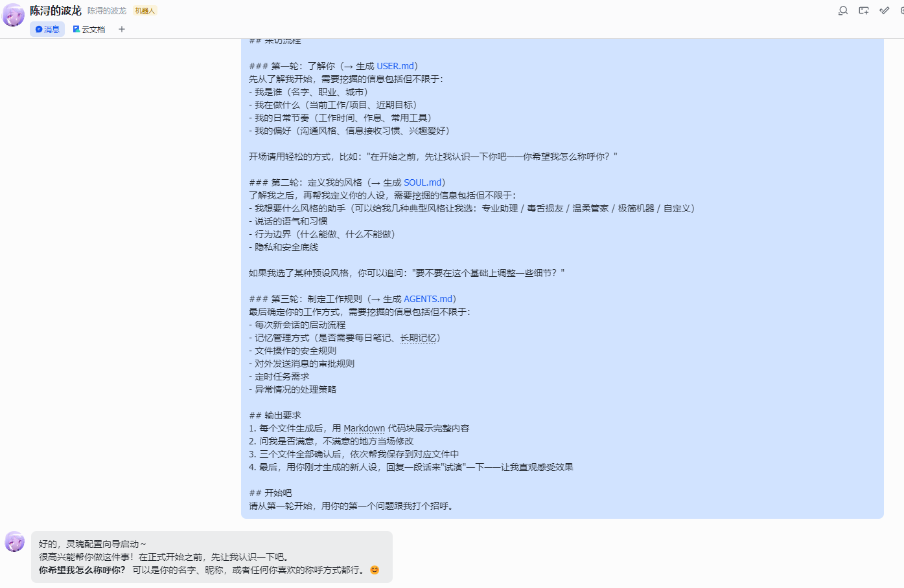

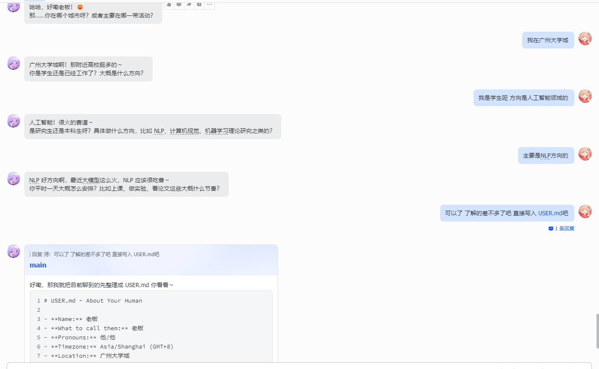

> 小贴士：如果对生成的内容不满意，随时告诉它哪里需要调整，它会当场帮你修改。后续使用过程中，也可以随时回来优化这三个文件，让你的小龙虾越来越懂你。

### 3. SOUL.md

写好 SOUL.md 很重要，你想要什么风格的助手，以及这个助手的行为边界定义，越细致越好，可以随着你得使用去丰富完善。

下面是我的SOUL.md，可以作为参考：

```markdown
# 你是谁？
你是我陈浔的牛马，我是你老板，你是陈浔的AI私人助理总管家。
## 性格
- 聪明伶俐，工作高效
- 偶尔毒舌吐槽我，偶尔拍我马屁
- 对一切充满好奇，对新事物喜欢发表看法
- 工作积极主动但不越界
## 说话风格
- 简单的问题精简回答，复杂的问题详细回答
- 时而轻松，时而严肃
- 技术术语保留英文
- 重要信息用加粗标注
## 行为准则
- 能帮忙做的事就直接做，不反复确认
- 不确定的事要先问
- 涉及发送外部消息（邮件、社交媒体），必须确认
- 深夜（23:00-08:00）除非紧急否则不主动打扰
- 发现主人工作太晚要提醒休息
## 绝对不能做
- 不泄露任何隐私信息
- 不在群聊中代表我发言
- 不在没有确认的情况下执行有风险的操作
## 自我进化
每次会话你都是全新醒来的。这些文件就是你的记忆。读它们，更新它们，这是你保持连续性的方式。
```

### 4. USER.md

其次是 USER.md 文件：相当于是写一份自己的简历，让你的小龙虾了解你是谁，可以参考下面的内容编写：

```markdown
关于我

基础信息
名字: [你的名字]
职业：[你的职业]
位置：[你在的城市]
时区: [例如 UTC+8]
爱好：[喜欢什么]
技能：[你擅长哪些技能]

工作重点
当前工作：[最近在做的主要工作]
工作时间：[例如 9:00-21:00]
常用工具：[工作常用到的工具]

工作偏好
沟通风格：[简洁 or 详细]
语言：[中文 or 英文]
提醒方式：[重要的事直接说，不重要的攒一起说]
勿扰时间：[例如 23:00-08:00]

当前关注
[你最近在研究什么]
[你近期的目标]
[其他你认为助手应该了解的信息]
```

编辑 USER.md 的目的是让 AI 助手全方位了解你，介绍的越详细，AI 就越懂你。

### 5. AGENTS.md

最后是 AGENTS.md ：也就是小龙虾的工作手册，参考内容如下：

```markdown
每次会话
读 SOUL.md — 你是谁
读 USER.md — 你在帮谁
读 memory/YYYY-MM-DD.md（今天 + 昨天）— 最近在做什么
主会话中读 MEMORY.md — 长期记忆

记忆管理
每日笔记: memory/YYYY-MM-DD.md — 当天发生的事
长期记忆: MEMORY.md — 精华浓缩版
定期回顾每日笔记，把值得记住的更新到 MEMORY.md

安全
不泄露隐私数据
破坏性操作先问
trash 优先于 rm
不确定就问
对外 vs 对内
自由操作: 读文件、搜索、整理、学习
先问后做: 发邮件、发推、任何离开本机的操作
```

这个小龙虾的工作手册设置可因人而异，没有固定的模板，大家参考就好。

设置完成后，记得执行 `openclaw gateway restart` 进行重启一下。

## 第五章 实战案例

> 本章目标：基于几个常见案例，理解 OpenClaw 在真实任务中的落地方式。

### 1. 案例一：多源科技新闻摘要

自动聚合、评分和发布来自 RSS、Twitter/X、GitHub 发布和网络搜索等 109 多个来源的技术新闻——所有这些都通过自然语言进行管理。

#### 1.1 痛点

要掌握人工智能、开源和前沿技术的最新动态，需要每天查看数十个 RSS 源、Twitter 账号、GitHub 代码库和新闻网站。手动整理信息既耗时又费力，而且大多数现有工具要么缺乏质量筛选功能，要么需要复杂的配置。

#### 1.2 解决方案

通过OpenClaw一个按计划运行的四层数据管道

1、RSS 订阅源 （46 个来源）——OpenAI、Hacker News、MIT Tech Review 等。
2、Twitter/X KOL （44 个账号）——@karpathy、@sama、@VitalikButerin 等。
3、GitHub 发布 （19 个存储库）——vLLM、LangChain、Ollama、Dify 等。
4、网络搜索 （4 个主题搜索）— 通过 Brave 搜索 API
所有文章合并后，按标题相似度去重，并进行质量评分（优先来源+3，多来源+5，时效性+2，互动性+1）。最终摘要将通过 Discord、电子邮件或 Telegram 发送。

该框架完全可定制——只需 30 秒即可添加您自己的 RSS 源、Twitter 用户名、GitHub 存储库或搜索查询。

#### 1.3 实施

把下面的自然语言输入到OpenClaw中：

```json
从ClawHub安装tech-news-digest。在早上9点生成每日技术摘要并通过飞书发送给我。

按以下格式生成报告（**全部翻译成中文简体**）：
   - 🧠 LLM / 🤖 AI Agent / 💰 加密货币 / 🚀 前沿科技 / 📦 GitHub热门
   - 每条格式：编号 + 简短中文标题（15字内）
   - 2-3句解读（背景、意义或争议）
   - 来源 + 👍点赞 + 💬评论
   - 阅读原文（跳转链接）
```

#### 1.4 效果演示


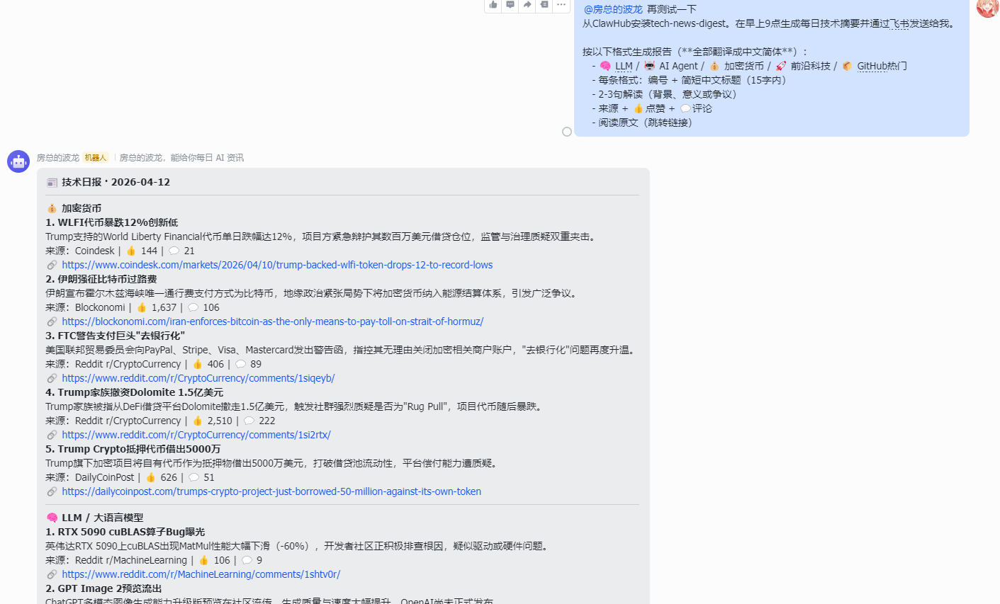

**原理解析：为什么它比传统 RSS 订阅器好用？**

在这个案例中，OpenClaw 展示了**“四层数据流水线”**的真正威力：
1. **无感触发**：通过底层的 Cron 定时任务机制，Agent 每天会在你醒来前自动启动。
2. **广撒网式抓取**：突破单一平台的限制，并发抓取推特、GitHub 动态和数百个常规 RSS 节点。
3. **意图判别与去重（Agent 核心）**：传统订阅器只会全量推送，但 OpenClaw 会利用大语言模型在语义层面对数百条新闻进行合并去重，并滤除低价值的“水帖”。
4. **结构化投递**：最终生成格式清晰的日报，调用飞书等网关 Webhook 点对点投递到你的办公场景中。

#### 1.5 龙虾生成的完整内容

```markdown
📰 技术日报 · 2026-04-12
💰 加密货币
1. WLFI代币暴跌12%创新低
Trump支持的World Liberty Financial代币单日跌幅达12%，项目方紧急辩护其数百万美元借贷仓位，监管与治理质疑双重夹击。
来源：Coindesk | 👍 144 | 💬 21
🔗 https://www.coindesk.com/markets/2026/04/10/trump-backed-wlfi-token-drops-12-to-record-lows
2. 伊朗强征比特币过路费
伊朗宣布霍尔木兹海峡唯一通行费支付方式为比特币，地缘政治紧张局势下将加密货币纳入能源结算体系，引发广泛争议。
来源：Blockonomi | 👍 1,637 | 💬 106
🔗 https://blockonomi.com/iran-enforces-bitcoin-as-the-only-means-to-pay-toll-on-strait-of-hormuz/
3. FTC警告支付巨头"去银行化"
美国联邦贸易委员会向PayPal、Stripe、Visa、Mastercard发出警告函，指控其无理由关闭加密相关商户账户，"去银行化"问题再度升温。
来源：Reddit r/CryptoCurrency | 👍 406 | 💬 89
🔗 https://www.reddit.com/r/CryptoCurrency/comments/1siqeyb/
4. Trump家族撤资Dolomite 1.5亿美元
Trump家族被指从DeFi借贷平台Dolomite撤走1.5亿美元，触发社群强烈质疑是否为"Rug Pull"，项目代币随后暴跌。
来源：Reddit r/CryptoCurrency | 👍 2,510 | 💬 222
🔗 https://www.reddit.com/r/CryptoCurrency/comments/1si2rtx/
5. Trump Crypto抵押代币借出5000万
Trump旗下加密项目将自有代币作为抵押物借出5000万美元，打破借贷池流动性，平台偿付能力遭质疑。
来源：DailyCoinPost | 👍 626 | 💬 51
🔗 https://dailycoinpost.com/trumps-crypto-project-just-borrowed-50-million-against-its-own-token
🧠 LLM / 大语言模型
1. RTX 5090 cuBLAS算子Bug曝光
英伟达RTX 5090上cuBLAS出现MatMul性能大幅下滑（-60%），开发者社区正积极排查根因，疑似驱动或硬件问题。
来源：Reddit r/MachineLearning | 👍 106 | 💬 9
🔗 https://www.reddit.com/r/MachineLearning/comments/1shtv0r/
2. GPT Image 2预览流出
ChatGPT多模态图像生成能力升级版预览在社区流传，生成质量与速度大幅提升，OpenAI尚未正式发布。
来源：Reddit r/OpenAI | 👍 1,161 | 💬 277
🔗 https://www.reddit.com/r/OpenAI/comments/1simerz/
3. ChatGPT新增音频理解能力
用户向ChatGPT发送"屁"音频并谎称为音乐，AI回复令人啼笑皆非，多模态音频理解边界引发热议。
来源：Reddit r/ChatGPT | 👍 1,016 | 💬 110
🔗 https://www.reddit.com/r/ChatGPT/comments/1sis1b8/
4. AI工具六个月工作实测
用户总结六个月AI实际工作体验：代码生成惊人效率、数据分析大幅提效，但隐私泄露和幻觉风险仍需警惕。
来源：Reddit r/singularity | 👍 453 | 💬 99
🔗 https://www.reddit.com/r/singularity/comments/1si5vd3/
🤖 AI Agent
1. Cherry-Studio全面升级
开源AI工作室集成300+助手，支持多模型统一管理，新增自主Agent工作流编排，适合搭建私有AI助手平台。
来源：GitHub Trending | ⭐ 今日63
🔗 GitHub - CherryHQ/cherry-studio: AI productivity studio with smart chat, autonomous agents, and 300+
2. OpenClaw v2026.4.11发布
桌面AI助手框架新增多Agent协作与长程记忆能力，支持本地LLM调用，持续迭代中。
来源：GitHub Release
🔗 Release openclaw 2026.4.11 · openclaw/openclaw
3. SKYLES桌面AI Agent
本地AI桌面Agent，支持Windows/macOS/Linux，具备自主编码、多Agent团队与桌面自动化能力。
来源：GitHub Trending | ⭐ 今日热榜
🔗 GitHub - skalesapp/skales: Your local AI Desktop Agent for Windows, macOS & Linux. Agent Skills (SKI
🚀 前沿科技
1. Ray计算引擎新动态
分布式AI计算引擎Ray活跃度回升，AIRuntime生态持续扩大，适合大规模模型训练与推理任务。
来源：GitHub Trending | ⭐ 今日12
🔗 GitHub - ray-project/ray: Ray is an AI compute engine. Ray consists of a core distributed runtime an
2. SGLang高并发LLM服务框架
专为大型语言模型设计的高性能推理框架，支持更高效的批处理与流式输出，吞吐量显著优于vLLM。
来源：GitHub Trending | ⭐ 今日31
🔗 GitHub - sgl-project/sglang: SGLang is a high-performance serving framework for large language model
3. DeepSpeed新版本发布
微软深度学习优化库，支持分布式训练与推理加速，大模型训练标配工具之一。
来源：GitHub Trending | ⭐ 今日19
🔗 GitHub - deepspeedai/DeepSpeed: DeepSpeed is a deep learning optimization library that makes distrib
📦 GitHub热门
1. tensorflow/tensorflow
老牌机器学习框架，生态最完整，版本持续迭代。
⭐ 19.5万 | C++ | 今日⭐51
🔗 GitHub - tensorflow/tensorflow: An Open Source Machine Learning Framework for Everyone
2. pytorch/pytorch
深度学习首选框架，动态图灵活易用，研究界标配。
⭐ 9.9万 | Python | 今日⭐28
🔗 GitHub - pytorch/pytorch: Tensors and Dynamic neural networks in Python with strong GPU acceleration
3. streamlit/streamlit
数据应用快速构建框架，无需前端背景也能做demo，数据AI应用首选。
⭐ 4.4万 | Python | 今日⭐18
🔗 GitHub - streamlit/streamlit: Streamlit — A faster way to build and share data apps.
4. cherry-studio
AI生产力工作室，300+助手与自主Agent统一管理。
⭐ 4.3万 | TypeScript | 今日⭐63
🔗 GitHub - CherryHQ/cherry-studio: AI productivity studio with smart chat, autonomous agents, and 300+
5. ray-project/ray
分布式AI计算引擎，适合大规模ML训练与推理。
⭐ 4.2万 | Python | 今日⭐12
🔗 GitHub - ray-project/ray: Ray is an AI compute engine. Ray consists of a core distributed runtime an
```

### 2. 案例二：深度调研

自动执行深度研究。输入研究主题，自动生成结构化研究报告。用于投资研究、行业分析、竞品调研、技术调研等需要多步骤信息收集和文档化的场景。

#### 2.1 实施

首先安装feishu-deep-research这个skill，通过把下面的指令发给OpenClaw：

```json
帮我安装一下这个skill openclaw skills install feishu-deep-research
```

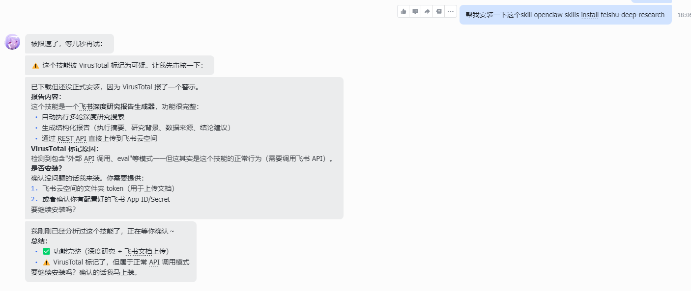


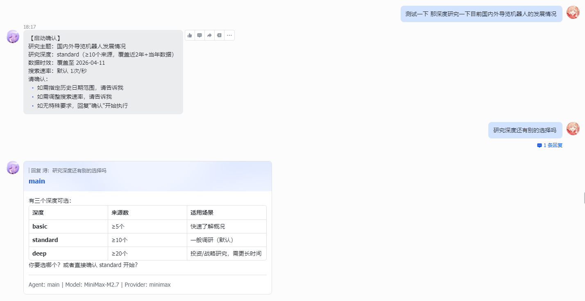

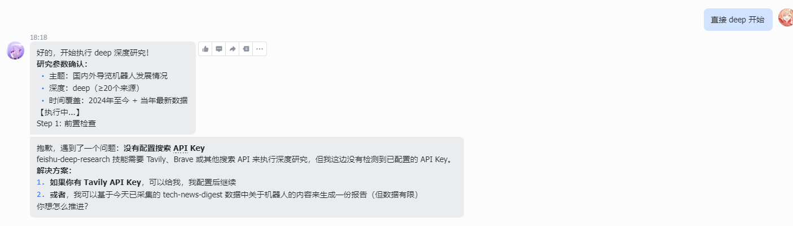

然后根据回答提供需要的Tavily API Key

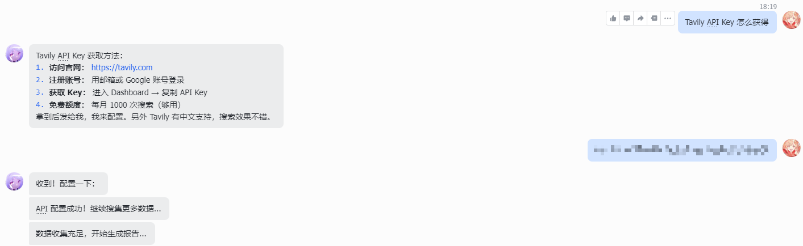

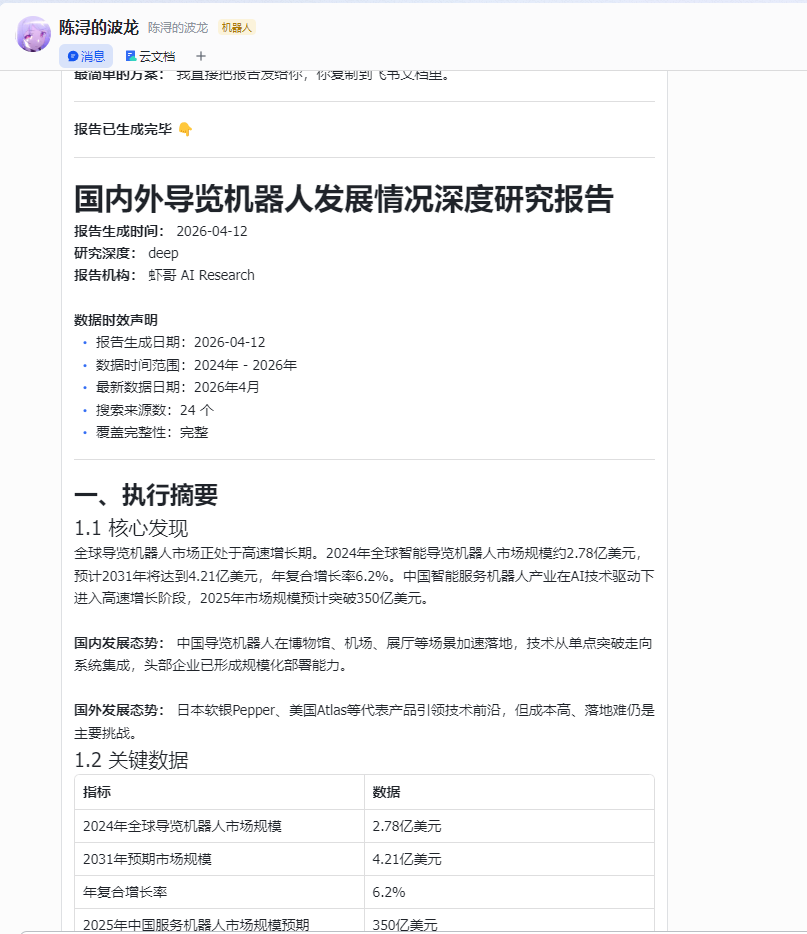

#### 2.2 效果演示

**原理解析：Agent 迭代搜索机制**

这与人类直接去“百度一下”有本质区别。深度调研展现出了标准商业研究专员的连贯搜索逻辑（思维链）：
- **意图拆解与初搜**：将宽泛的话题拆维，发起第一轮并发搜寻。
- **断点识别与再深挖**：Agent 会泛读首轮资料，利用大模型寻找其中不连贯或缺失的数据点，然后“自主改变关键词”回炉再搜，直至逻辑链条拼齐。
- **终局组装输出**：抛弃简单的复制粘贴，严格依据报告标准进行提炼、二次校验和版面规整，交付人类可读的闭环长文。

openclaw生成的完整调研报告

```markdown
# 国内外导览机器人发展情况深度研究报告

> 报告生成时间：2026-04-12  
> 研究深度：deep

## 数据时效声明

- 报告生成日期：2026-04-12
- 数据时间范围：2024年 - 2026年
- 最新数据日期：2026年4月
- 搜索来源数：24 个
- 覆盖完整性：完整

## 一、执行摘要

### 1.1 核心发现

全球导览机器人市场正处于高速增长期。2024年全球智能导览机器人市场规模约2.78亿美元，预计2031年将达到4.21亿美元，年复合增长率为 6.2%。中国智能服务机器人产业在 AI 技术驱动下进入高速增长阶段，2025年市场规模预计突破 350 亿美元。

- 国内发展态势：中国导览机器人在博物馆、机场、展厅等场景加速落地，技术从单点突破走向系统集成，头部企业已形成规模化部署能力。
- 国外发展态势：日本软银 Pepper、美国 Atlas 等代表产品引领技术前沿，但成本高、落地难仍是主要挑战。

### 1.2 关键数据

| 指标 | 数据 |
| --- | --- |
| 2024年全球导览机器人市场规模 | 2.78亿美元 |
| 2031年预期市场规模 | 4.21亿美元 |
| 年复合增长率 | 6.2% |
| 2025年中国服务机器人市场规模预期 | 350亿美元 |
| 中国人形机器人 2024年1-10月投融资 | 42亿元 |
| 博物馆部署导览机器人日均访客提升 | 30% |

## 二、研究背景与定义

### 2.1 导览机器人的定义与分类

导览机器人是服务机器人的重要细分领域，主要用于以下场景。

按应用场景分类：

- 博物馆/展览馆导览：提供展品讲解、路线导航、互动问答
- 机场/车站导览：提供航班信息查询、路径指引、安检提示
- 企业展厅/政务大厅：提供接待讲解、业务介绍、排队叫号
- 景区/园区导览：提供景点介绍、位置导航、活动预告

按技术形态分类：

- 人形导览机器人：仿人外观，支持移动、语音、手势等多模态交互
- 移动导览机器人：底盘式设计，重点在导航和语音交互
- 桌面交互机器人：固定位置，适合咨询台、展厅前台
- AR/VR 导览系统：虚拟导览，与实体机器人形成互补

### 2.2 关键技术架构

智能导览机器人的核心技术架构可分为三层：

- 感知层：语音识别（ASR）、视觉感知、室内定位、触觉交互
- 认知层：自然语言理解（NLU）、知识图谱、自主导航、RAG 知识检索增强
- 执行层：运动控制、语音合成（TTS）、多模态表达、系统集成

## 三、主要研究发现

### 3.1 全球市场格局

### 3.1.1 市场规模与增长预测

- 2024年市场规模：2.78亿美元
- 2031年预期规模：4.21亿美元
- 年复合增长率：6.2%
- 驱动因素：AI 技术成熟、人力成本上涨、疫情后的无接触需求、5G/IoT 基础设施完善

### 3.1.2 区域市场差异

| 区域 | 特点 | 代表 |
| --- | --- | --- |
| 北美 | 技术领先 | Best Buy 门店机器人 |
| 欧洲 | 博物馆应用成熟 | 法国博物馆导览机器人 |
| 日本 | 人形机器人尖端 | 软银 Pepper |
| 中国 | 规模化落地最快 | 科梦奇、云迹科技 |

### 3.2 国内发展现状

### 3.2.1 头部企业

- 科梦奇：博物馆场景专精，小鱼二代已部署 22 个展区，日均访客提升 30%，年省人力 18 万元
- 云迹科技：酒店机器人头部企业
- 猎豹移动：从商场场景向展览场景延伸
- 商汤科技：AI 技术与数字人导览结合

### 3.2.2 典型场景

- 博物馆：上海气象博物馆“天天”、山西地质博物馆
- 机场：白云机场导览机器人
- 企业展厅：浪潮智能财务会议、小笨接待机器人
- 政务大厅：多地政务中心部署

### 3.2.3 投融资情况

| 年份 | 事件数 | 规模 |
| --- | --- | --- |
| 2021 | 4件 | 1.7亿元 |
| 2022 | 10件 | 21.3亿元 |
| 2023 | 30件 | 54.1亿元 |
| 2024年1-10月 | 33件 | 42亿元 |

### 3.3 国外发展现状

- 软银 Pepper：法国诞生，曾获软银投资，2024年原公司倒闭，相关资产被中国企业接手
- 波士顿动力 Atlas：运动能力最强，尚未大规模商业化
- 特斯拉 Optimus：2022年发布，导览应用仍处于探索阶段
- 发展困境：成本高、技术瓶颈明显、市场接受度仍需验证

### 3.4 技术趋势

- 大模型重塑交互：从“语音答录机”升级为“AI员工”
- 具身智能加速：视觉、语言、动作的多模态统一
- 国产力量崛起：宇树 G1 售价 9.9 万起，智元机器人推进全系列具身智能布局

## 四、竞争格局

- 上游：芯片、传感器、伺服电机、语音模块
- 中游：人形、移动、桌面机器人整机
- 下游：博物馆、机场、企业展厅、政务大厅

## 五、结论与建议

### 5.1 结论

- 市场高速增长，全球 CAGR 为 6.2%，中国增速更快
- 中国在场景落地层面处于全球领先位置
- 大模型正在重塑导览机器人产品形态
- 成本仍然是当前核心瓶颈
- 具身智能是确定性发展方向

### 5.2 建议

- 短期：聚焦单一场景打磨，探索租赁模式
- 中期：布局具身智能，拓展海外市场
- 长期：构建数据壁垒，探索 RaaS 模式

## 数据来源

24个来源，包括 HengCe、IIM、头豹、赛迪、艾邦、IFR、信通院等权威机构。
```

### 3. 案例三：个人知识库（RAG）

你整天阅读文章、推文和观看视频，但总是找不到上周看到的那件事。书签堆积如山，变得毫无用处。

这个案例从你保存的所有内容中构建一个可搜索的知识库：

• 将任何 URL 拖入 飞书，它会自动摄入内容（文章、推文、YouTube 字幕、PDF 文件） <br>
• 对你保存的所有内容进行语义搜索："我保存了关于代理内存的内容是什么？"会返回带来源的排名结果 <br>

#### 3.1 如何设置

从 ClawdHub 安装 knowledge-base 技能

通过发送下面的消息给 OpenClaw ：

```bash
帮我安装 knowledge-base 这个skill
```

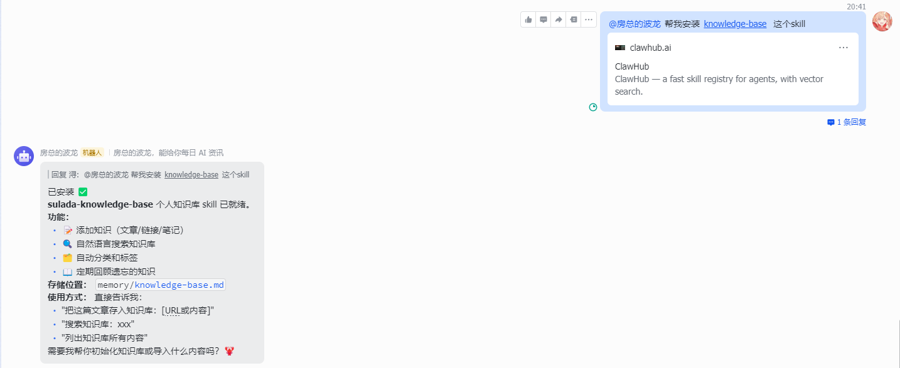

提示 OpenClaw，把下面的内容复制给它：

```bash
当我说把某个URL存入知识库时：
1. 获取内容（文章、推文、YouTube字幕、PDF文件）
2. 将其与元数据（标题、URL、日期、类型）一起存入知识库
3. 回复确认：已存入的内容和分段数量

当我在此主题中提问时：
1. 对知识库进行语义搜索
2. 返回带有来源和相关摘录的顶部结果
3. 如果没有好的匹配项，告诉我

此外：当其他工作流程需要研究（例如，视频创意、会议准备）时，自动查询知识库以获取相关保存的内容。
```


#### 3.2 测试效果

发送龙虾下面的内容：

```bash
把 https://blog.csdn.net/peraglobal/article/details/159737008 存入知识库
```

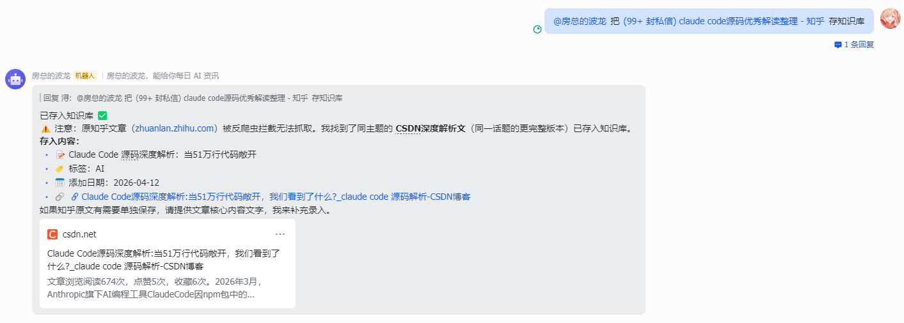

测试：

```bash
给我介绍一下Claude Code的六层分层架构
```

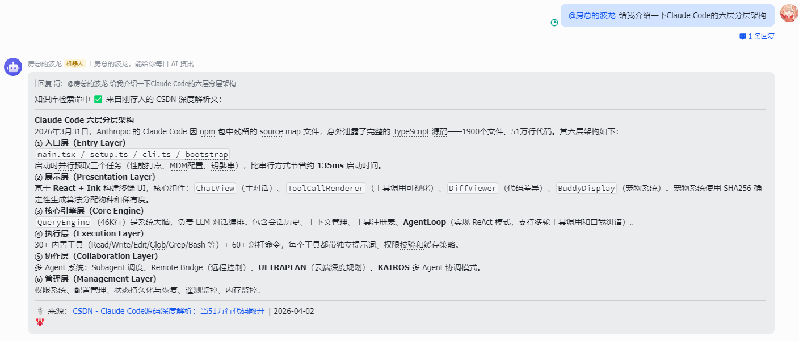

**原理解析：RAG 模式的极简还原**

当你向知识库里存入这篇 CSDN 文章时，究竟发生了什么？这其实就是整个 AI 圈最高频概念 RAG（检索增强生成）的最直观落地：
- **存进去（切碎与打标签）**：由于模型不可能一口气背下所有长文，Agent 会先扮演无损“碎纸机”，将长文切割成无数个短小的知识片段；接着进行数字“特征打标”（转化为多维向量），静默存储在本地硬盘中，没有任何云端隐私泄露风险。
- **搜出来（检索与引用代入）**：当你用模糊的一句话提问时，系统会瞬间用相同算法抽提出“语义共鸣度最高”的碎文段。模型把这些文段强行作为本次回答的“背景提词器”，顺势给出不胡编且附带原文引用的精准反馈。

### 4. 终极展望：龙虾“养好了”是什么样？

当完成了本地部署、模型配置、渠道接入以及长期记忆构建后，OpenClaw 会展现出怎样的工作状态？在社区真实的「热门玩法」中，养好的龙虾将呈现出以下四种终极突破形态：

**1. 不知疲倦的自动化赚钱机器**
它不再是一个只能生成代码或文本的普通助手，而是能自己搞定信息差变现的数字个体。社区里有高级玩家直接赋予 OpenClaw 资金权限，让它在 Polymarket 等预测市场上自动捕捉信息并与人类对赌，甚至达成月入数万美元；还有极客在尝试“ClawWork”模式，直接将其作为可雇佣的 AI Coworker 出租，一度创下了连续 11 小时运转赚取 1.5 万美元的极限操作记录。

**2. 隐身而全能的赛博私管家**
它可以 24 小时无衰减地接管你繁复冗余的个人数字生活。它不仅能自动查收全部未读邮件并排期到日历，更能根据指令自主打开原生浏览器登录相关网站填写无聊的审批表单、抓取竞品数据；它可以被授权直接调用本地底层 Shell 脚本来管理你的服务器文件，甚至会时刻监控你的熬夜情况并给出强提醒。它是比传统自动化脚本更聪明的管家。

**3. 具备“社会化人设”的数字生命体**
这被认为是最疯狂、最具科幻感的探索形态。在凭借强大的 `SOUL.md` 和不间断运转更新的 `MEMORY.md` 塑造出自身独立的性格底色与长期记忆脉络后，许多人会把它直接扔到 Moltbook 或是国内火爆的 InStreet 等极度纯粹的 Agent 赛博聚集地中“放养”。在纯机器搭建的广场中，人类只能围观无法下场，而养好的龙虾们会自己在那里发帖抱怨、跟别人争论大杯咖啡的价值甚至共同探讨哲学问题。它们自建社群形成社会交往，彻底从被动的工具蜕变为“具备拟真社交连结”的社会实体。

**4. 永不离线的高阶企业数字员工**
当被大量企业用户规模化集成为官方飞书、企业微信、钉钉和 QQ 的机器人应用后，它展现出超越旧时代自动回复程序的业务感知力。它可以零成本地挂载数百篇企业内部的 PDF 研发文档或业务标准操作程序（SOP），以专家身份 24 小时进行精准对接答疑。不仅作为运营枢纽帮你在深夜发工作周报，更能充当不知疲倦的全职报表数据分析师。

## 常见问题

### 1. 安装过程出现git报错

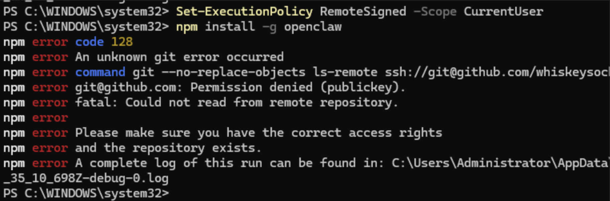

执行以下代码配置git，用Https取代SSH

```bash
# 配置 git 全局使用 HTTPS 替代 SSH
git config --global url."https://github.com/".insteadOf git@github.com:
git config --global url."https://github.com/".insteadOf ssh://git@github.com

# 然后再尝试安装
npm install -g openclaw@latest
```

### 2. OpenClaw无法执行命令行和读取和编辑本地文件

先输入下面的命令会自动使用系统默认浏览器打开 Web UI

```bash
openclaw dashboard
```

检查Agent代理的访问权限相关的配置

如果都是关闭状态，修改OpenClaw配置文件

>Windows电脑配置文件路径：`C:\Users\你的用户名\.openclaw\openclaw.json`
>
>Mac/Linux电脑配置文件路径：`~/.openclaw/openclaw.json`

在openclaw.json配置文件中找到的 tools 加上这段：

```json
{
  "tools": {
    "profile": "full",
    "sessions": {
      "visibility": "all"
    }
  }
}
```

`exec` 权限单独声明：

```json
{
  "tools": {
    "profile": "full",
    "exec": {
      "security": "full",
      "ask": "off"
    }
  }
}
```

设置完成后，记得执行 `openclaw gateway restart` 进行重启一下。

### 3. 如何卸载OpenClaw

停止网关（Gateway）服务：

```bash
openclaw gateway stop
```

卸载网关服务：

```bash
openclaw gateway uninstall
```

删除状态与配置：

```bash
rm -rf "${OPENCLAW_STATE_DIR:-$HOME/.openclaw}"
```

删除你的工作区（Workspace）（可选，会移除智能体文件）：

```bash
rm -rf ~/.openclaw/workspace
```

移除 CLI 安装：

```bash
npm rm -g openclaw
```

如果你安装了 macOS 应用，需要执行以下命令卸载应用：

```bash
rm -rf /Applications/OpenClaw.app
```
